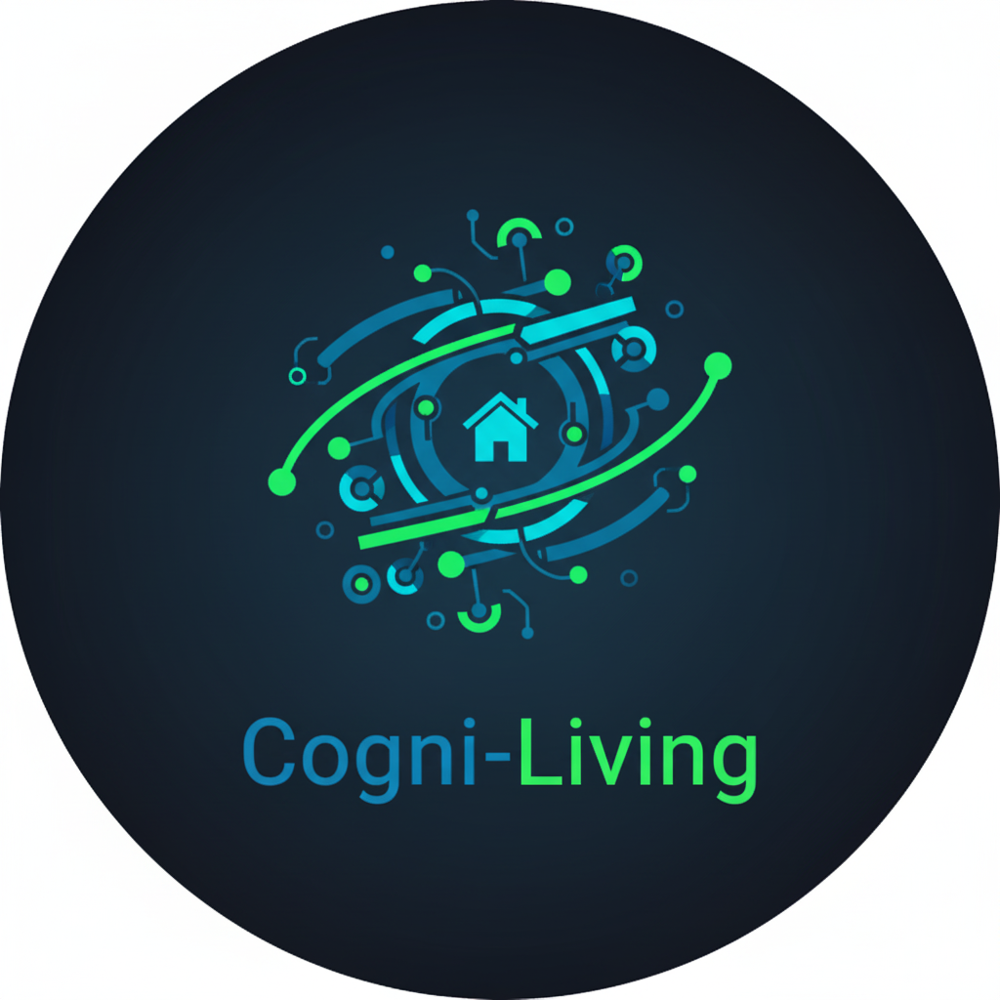

# ioBroker.cogni-living

**KI-gestützte Verhaltensanalyse für Gesundheit, Sicherheit & Komfort.**

---

## 📖 Über diesen Adapter

**Cogni-Living** verwandelt Ihr Smart Home von einem passiven System in einen intelligenten, mitdenkenden Assistenten. Statt hunderte Regeln manuell zu programmieren ("Wenn Bewegung, dann Licht"), nutzt dieser Adapter modernste Künstliche Intelligenz (**Google Gemini**), um Ihre Sensordaten zu verstehen und zu interpretieren.

Besonders geeignet für:
* **Ambient Assisted Living (AAL):** Sorgenfreies Wohnen für Senioren durch intelligente Routine-Überwachung.
* **Sicherheit:** Erkennung von Anomalien, die klassische Alarmanlagen übersehen.
* **Gesundheits-Monitoring:** Erkennung schleichender Verhaltensänderungen (z.B. verringerte Mobilität).

---

## ⚙️ Funktionsweise & Historie

Der Adapter arbeitet mit einem dualen Gedächtnismodell, das über 26 Entwicklungs-Sprints gereift ist:

### 1. Kurzzeit-Gedächtnis (STM) [Sprints 1-20]
Der "Autopilot" überwacht die letzten 50 Ereignisse in Echtzeit.
* **Beispiel:** Es ist 3 Uhr nachts, die Haustür öffnet sich, aber niemand ist im Flur? -> **Alarm.**
* **Beispiel:** Der Bewohner ist im Bad gestürzt und hat sich seit 30 Minuten nicht bewegt? -> **Alarm.**

### 2. Langzeit-Gedächtnis (LTM) [Sprint 21]
Jede Nacht erstellt die KI eine Zusammenfassung ("Daily Digest") des Tages und lernt die normalen Gewohnheiten des Bewohners.
* **Drift Analyse:** Ein spezieller Algorithmus vergleicht das Verhalten der letzten 2 Wochen mit dem Langzeitdurchschnitt. Dies erkennt schleichende Veränderungen (z.B. "Bewohner verlässt das Haus viel seltener als früher").

### 3. Professionelles Fundament [Sprints 22-24]
* **SaaS Sicherheit:** Code-Verschlüsselung und Lizenzprüfung.
* **Auto-Discovery:** Ein Wizard findet automatisch Ihre Sensoren im System.
* **Feedback-Loop:** Nutzer können die KI trainieren ("Daumen hoch/runter").

---

## 🚀 Features im Detail

### 🛡️ Aktiver Schutz (Totmannschalter) [NEU Sprint 25/26]
Standard-KI-Systeme reagieren nur, wenn etwas passiert. **Cogni-Living reagiert auch, wenn NICHTS passiert.**
* **Inaktivitäts-Monitor:** Wenn über einen definierten Zeitraum (z.B. 12 Stunden) keine Sensoraktivität erkannt wird, obwohl der Bewohner zuhause ist, löst der Adapter einen **NOTFALL** (Emergency) aus.
* **Smarte Anwesenheit:** Das System unterscheidet automatisch zwischen "Schlafen" (Anwesend) und "Einkaufen" (Abwesend) durch intelligente Analyse der Tür-Sensoren.
* **Notfall-Eskalation:** Im Gegensatz zu normalen Warnungen lösen Notfall-Events Push-Nachrichten mit höchster Priorität aus (z.B. Pushover Priority 2 mit Sirene/Bestätigungszwang).

### 📊 LTM Dashboard & Health
Visualisieren Sie das Verhalten direkt im Admin-Panel.
* **[NEU Sprint 27] Health Dashboard:** Überwachung von Schlafqualität und nächtlicher Unruhe.
* Balkendiagramme zeigen das Aktivitätslevel pro Tag.
* Detaillierte Text-Zusammenfassungen erklären den Tagesablauf.
* Der Drift-Indikator warnt vor langfristigen negativen Trends.

### 🔔 Intelligente Benachrichtigungen
Erhalten Sie Warnungen nicht nur als Log-Eintrag, sondern direkt auf Ihr Smartphone. Unterstützte Dienste:
* Telegram
* Pushover (Unterstützt Notfall-Priorität & Retry)
* E-Mail
* WhatsApp (via CMB Adapter)
* Signal (via CMA Adapter)

---

## 💎 Free vs. Pro Version

| Feature | Free Version | Pro Version |
| :--- | :---: | :---: |
| **STM Echtzeit-Analyse** | ✅ | ✅ |
| **Totmannschalter (Inaktivität)** | ✅ | ✅ |
| **KI Kontext (Wetter/Persona)** | ✅ | ✅ |
| **Auto-Discovery Wizard** | ✅ | ✅ |
| **Benachrichtigungen** | ✅ | ✅ |
| **Langzeit-Gedächtnis (LTM)** | ❌ | ✅ |
| **Tägliche Zusammenfassungen** | ❌ | ✅ |
| **Drift Analyse (Gesundheit)** | ❌ | ✅ |
| **Automatisierungs-Vorschläge** | ❌ | ✅ |
| **LTM Dashboard** | ❌ | ✅ |

> **Hinweis zur Pro Version:** Für den gewerblichen Einsatz oder vollen Funktionsumfang ist ein Lizenzschlüssel erforderlich.

---

## 🛠️ Einrichtung in 5 Schritten

1.  **Installation:** Installieren Sie den Adapter über ioBroker Admin.
2.  **API Key:** Holen Sie sich einen kostenlosen [Google Gemini API Key](https://aistudio.google.com/app/apikey) und tragen Sie ihn in den Einstellungen ein.
3.  **Auto-Scan:** Klicken Sie im Konfigurations-Tab auf **"Auto-Scan (Wizard)"**. Wählen Sie Ihre Sensoren aus und importieren Sie sie.
4.  **Kontext:** Beschreiben Sie kurz die Wohnsituation im Feld "Kontext" (z.B. *"Bewohner ist 82 Jahre alt, lebt allein, hat einen Hund."*). Dies hilft der KI massiv, Fehlalarme zu vermeiden.
5.  **Sicherheit:** Aktivieren Sie den **Inaktivitäts-Monitor** in den Einstellungen, wenn Sie das System für AAL/Seniorenbetreuung nutzen.

---

## 📜 Changelog

### 0.3.10 (2025-11-26)
* (Marc Jaeger) **Health Dashboard Update**
* ✨ **Neu:** Visualisierung von Schlafqualität und Unruhe im LTM-Rückblick.
* ✨ **Neu:** Graphische Trennung von Aktivitäts- und Gesundheitsdaten.

### 0.3.5 (2025-11-26)
* (Marc Jaeger) **Wartungs-Update**
* 🛠️ **Fix:** Probleme mit UI-Übersetzungen und Speicher-Button behoben.
* 🛠️ **Fix:** Stabilisierung der Anwesenheits-Logik.

### 0.3.1 (2025-11-26)
* (Marc Jaeger) **Feature Release: Sicherheit**
* ✨ **Neu:** **Totmannschalter (Inaktivitäts-Monitor)** hinzugefügt.
* ✨ **Neu:** **Notfall-Status**. Unterscheidung zwischen "Warnung" (Gelb) und "Notfall" (Rot).
* ✨ **Neu:** Pushover Priority 2 Support (Notfall-Sirene & Retry) für kritische Alarme.

### 0.3.0 (2025-11-25)
* (Marc Jaeger) **Major UI Release**
* ✨ **Neu:** Komplettes UI Redesign ("App-like").
* ✨ **Neu:** Feedback-Loop (Reinforcement Learning) implementiert.
* 🛠️ **Fix:** Massive Verbesserungen am Dark Mode / High Contrast Theme.

---

## 📄 Lizenz

MIT Lizenz (Codebase).
Die Nutzung der Pro-Features unterliegt gesonderten Lizenzbedingungen.

Copyright (c) 2025 Marc Jaeger <mj112@gmx.de>