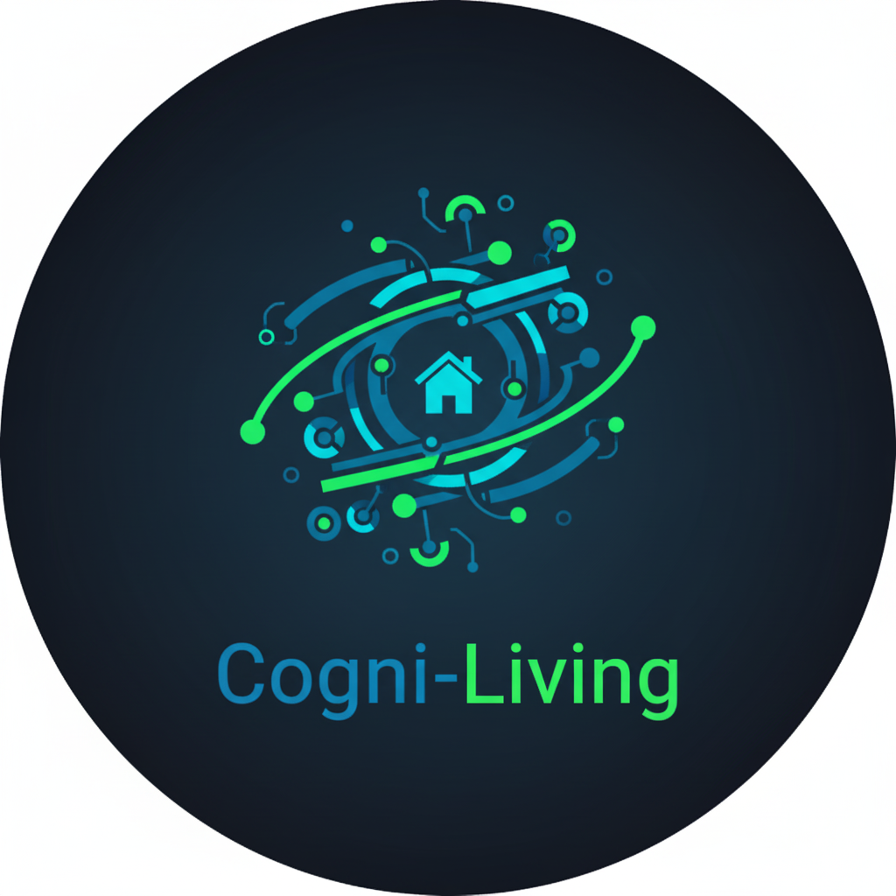

# ioBroker.cogni-living

> **🇺🇸 English Version:** [Read the English documentation here](README.md)

**Neuro-Symbolische Autonomie für Ihr Zuhause.**
*Beyond Automation: Sicherheit, Energie, Gesundheit & Komfort – getrieben von Deep Learning & Gemini.*

> **"Regelbasierte Smart Homes waren gestern. Cogni-Living ist ein adaptiver Organismus, der die Physik Ihres Hauses versteht und Ihre Intentionen vorausahnt."**

---

## 🧠 Was macht dieses System einzigartig?

Cogni-Living ist kein gewöhnlicher Adapter. Es ist eine **Hybrid-AI Engine**, die klassische IoT-Steuerung mit modernster Forschung aus den Bereichen **Machine Learning** und **Large Language Models (LLM)** verbindet — lokal, privat, ohne Cloud-Zwang.

> **Ehrlichkeit zuerst:** Dieses Projekt ist ein aktiv weiterentwickelter Forschungsprototyp. Die folgende Roadmap zeigt transparent, was bereits implementiert ist, was in Entwicklung ist und was zukünftig angestrebt wird.

---

## 🏛️ Die 4 Säulen der Autonomie

### 1. 🛡️ SECURITY: Adaptive Immunität
*Mehr als nur ein Alarmsystem. Ein Wächter, der den Kontext versteht.*

* **Spatio-Temporal Awareness:** Das System unterscheidet nicht nur "Bewegung ja/nein", sondern analysiert die *Sequenz* und *Geschwindigkeit*. Ein Einbrecher bewegt sich anders als ein Bewohner.
* **Few-Shot Learning (Party-Modus):** Dank adaptiver Overlay-Modelle lernt das System temporäre Abweichungen (Gäste, Handwerker) in Sekunden, ohne das Langzeitgedächtnis zu verwässern.
* **Zero-Trust Architektur:** Im Urlaubsmodus gelten verschärfte Regeln. Jede Anomalie wird sofort an die KI zur Bewertung gesendet.

### 2. 🍃 ENERGY: Der Physikalische Zwilling
*Heizen mit Prädiktion statt Reaktion. Spart Energie, bevor sie verschwendet wird.*

* **PINN-Technologie:** Das System berechnet live den **Isolations-Score** (Wie schnell kühlt der Raum aus?) und den **Heating-Score** (Wie schnell heizt er auf?).
* **Smart Schedule Automation:** Verknüpft Ihren Kalender mit der Physik. Wenn Sie "Urlaub Ende 18:00" eintragen, berechnet die KI exakt: "Ich muss um 14:23 Uhr starten, damit es punktgenau 21°C hat".
* **Virtual Sensing (Ventilation Detective):** Erkennt offene Fenster rein durch die Analyse von Temperaturstürzen (>3°C/h), selbst ohne physische Fenstersensoren.
* **MPC (Model Predictive Control):** Nutzt Wettervorhersagen und thermische Trägheit ("Coasting"), um die Heizung früher abzuschalten und Restwärme zu nutzen.

### 3. 🛋️ COMFORT: Der unsichtbare Butler
*Zero-UI: Das beste Interface ist kein Interface.*

* **Prädiktive Automation:** Das GCN berechnet die Wahrscheinlichkeit Ihres nächsten Raums. Das Licht im Bad geht schon an, *bevor* Sie die Tür öffnen.
* **Intent Learning:** Erkennt komplexe Zusammenhänge ("Wenn TV an und Uhrzeit > 20:00, dann Licht gedimmt").
* **LLM-Agenten:** Google Gemini fungiert als "Cortex", der komplexe Situationen bewertet und Entscheidungen in natürlicher Sprache erklärt.

### 4. ❤️ HEALTH: Digital Phenotyping
*Medizinische Frühwarnung ohne Kameras oder Wearables.*

* **Gait Speed Proxy:** Misst schleichende Veränderungen in der Gehgeschwindigkeit über Monate hinweg – ein wichtiger Vitalindikator.
* **Langzeit-Drift-Analyse:** Erkennt, wenn sich Schlafmuster oder Aktivitätsniveaus subtil verschlechtern (z.B. Anzeichen von Depression oder beginnender Demenz).
* **Kontext-Sensitiver Totmann-Schalter:** Ein Notruf, der nicht stur nach Zeit geht, sondern nach Wahrscheinlichkeit. ("Bewohner ist im Bad, kommt statistisch nach 15 min zurück. Nach 45 min -> Alarm").

---

## 🚀 Technologie-Stack

* **Backend:** Node.js (ioBroker) als Orchestrator & State-Manager
* **AI Core:** Python Sidecar (Scikit-Learn, NumPy) — läuft lokal auf der Hardware
* **Cloud AI:** Google Gemini Pro/Flash — nur für Textzusammenfassungen, keine Rohdaten
* **Frontend:** React/TypeScript mit Recharts (Admin UI) + PWA (Familien-App NUUKANNI)
* **Persistenz:** JSON History-Files (täglich), ioBroker States, Pickle-Modelle

---

## 🗺️ AURA MASTER ROADMAP — SÄULE GESUNDHEIT

> **Legende:** ✅ Implementiert · ⚠️ Teilweise/Vereinfacht · 🔬 Geplant (Forschung) · ❌ Noch nicht begonnen

### 📊 Algorithmen & Methoden — Vollständige Übersicht

| # | Ziel / Was wird gemessen | Algorithmus / Methode | Genutzt auch in | Implementiert seit | Status |
|---|---|---|---|---|---|
| 1 | **Tages-Anomalie:** Ist heute ungewöhnlich? | IsolationForest (96-dim Aktivitätsvektor) | Sicherheit | v0.30.68 | ✅ |
| 2 | **Nacht-Anomalie:** War diese Nacht für DIESE Person normal? | IsolationForest (20-dim Nacht-Slots, personalisiert) | — | v0.30.68 | ✅ |
| 3 | **Ganggeschwindigkeit:** Verändert sich die Mobilität über Monate? | Lineare Regression auf Flur-Durchgangszeiten | — | v0.28.0 | ✅ |
| 4 | **Aktivitätstrend (kurzfristig):** Steigt/fällt die Aktivität? | Lineare Regression auf Tages-Aktivitätswerte | — | v0.28.0 | ✅ |
| 5 | **Stündliche Heatmap:** Zu welcher Uhrzeit ist Aktivität anomal? | IsolationForest + Regelbasierte Tageszeit-Flags | — | v0.30.x | ✅ |
| 6 | **Lebenszeichen-Alarm:** Ist die Person in kritischer Stille? | Regelbasiert (Stunden seit letzter Aktivität je Raum) | — | v0.28.0 | ✅ |
| 7 | **Raum-Mobilität:** Wie viele Räume werden pro Tag genutzt? | Statistik (Mittelwert, Trend-Vergleich) | — | v0.30.x | ✅ |
| 8 | **Hygiene-Frequenz:** Verändert sich die Bad-Nutzung? | Statistik (Mittelwert, Trend-Vergleich) | — | v0.30.x | ✅ |
| 9 | **Lüftungsverhalten:** Wie oft wird gelüftet? | Statistik (Mittelwert, Trend-Vergleich) | Energie (Ventilation Detective) | v0.30.x | ✅ |
| 10 | **KI-Tagesbericht:** Was passierte heute in natürlicher Sprache? | Google Gemini LLM | Sicherheit, Energie | v0.25.x | ✅ |
| 11 | **KI-Nachtbericht:** Wie war die Nacht in natürlicher Sprache? | Google Gemini LLM | — | v0.25.x | ✅ |
| 12 | **Sicherheits-Anomalie:** Verhalten der letzten Tage normal? | IsolationForest auf tägliche Aktivitätsvektoren | Sicherheit | v0.30.69 | ✅ |
| 13 | **Raum-Histogramm-Anomalie:** Wird ein Raum ungewöhnlich wenig genutzt? | Statistik (Mittelwert − 2×Std als Schwellwert) | — | v0.30.58 | ✅ |
| 14 | **Aktivitätslevel (relativ, personalisiert):** Wie aktiv ist der Tag relativ zum persönlichen Schnitt? | Gleitender Median der letzten 14 Tage als Referenz | — | v0.30.69 (Y-Achse fix), **Normalisierung noch falsch** | ⚠️ |
| 15 | **Temporale Sequenz-Vorhersage:** "Um 07:30 erwarte ich Küche — heute nicht" | LSTM / Transformer auf stündlichen Aktivitätssequenzen | Sicherheit, Komfort | **GEPLANT** | 🔬 |
| 16 | **Graduelle Drift-Detektion:** Erkennung schleichender Verschlechterung über Monate (Demenz-Frühwarnung) | Page-Hinkley-Test oder CUSUM auf Langzeittrends | — | **GEPLANT** | 🔬 |
| 17 | **Zirkadianer Rhythmus-Modell:** Verschiebt sich der Schlaf-/Wach-Zyklus? | Kurzzeitfouriertransformation (STFT) oder Cosinor-Analyse | — | **GEPLANT** | 🔬 |
| 18 | **Konfidenz-Intervalle:** "Wie sicher sind wir, dass das anomal ist?" | Bootstrap-Konfidenzintervalle oder Bayesianisches IF | — | **GEPLANT** | 🔬 |
| 19 | **Kontext-Bewusstsein:** Feiertag, Besuch, Jahreszeit berücksichtigen | Kalender-Integration + saisonale Baseline-Korrektur | Energie | **GEPLANT** | 🔬 |
| 20 | **Formale Evaluation:** Wie gut erkennt das System echte Ereignisse? | Ground-Truth-Labeling + ROC/AUC-Metriken | — | **GRUNDLAGE FEHLT** | ❌ |

---

### 🔍 Was das README versprochen hat vs. was wirklich läuft

| README-Versprechen | Realität | Bewertung |
|---|---|---|
| "LSTM Autoencoder" | IsolationForest (kein LSTM, keine zeitliche Sequenz) | ⚠️ Vereinfacht — funktioniert, aber ohne Zeitdimension |
| "GCN (Graph Neural Networks)" | Topologie-Matrix als Adjazenzgraph (kein echtes Message-Passing-GCN) | ⚠️ Vereinfacht — Topologie-Bewusstsein vorhanden |
| "PINN (Physics AI)" | Implementiert für Energie-Säule | ✅ Korrekt |
| "Drift-Analyse" | Lineare Regression auf kurzfristige Trends; echte Drift-Detektion über Monate fehlt | ⚠️ Kurzfristig vorhanden, Langzeit-Drift fehlt |
| "Few-Shot Learning (Party-Modus)" | Nicht implementiert | ❌ Noch nicht vorhanden |

---

### 🎯 Nächste Entwicklungsschritte (priorisiert)

| Priorität | Was | Warum | Aufwand |
|---|---|---|---|
| 🔴 HOCH | Aktivitätslevel-Normalisierung auf persönlichen Median | Alle Balken zeigen 100% — falsche Formel | Klein |
| 🔴 HOCH | Tooltip-Format & JSON-Artefakte bereinigen | UX-Problem in PWA | Klein |
| 🟡 MITTEL | LSTM für stündliche Erwartungsmodellierung | Nächste Stufe der Anomalie-Erkennung | Groß |
| 🟡 MITTEL | Drift-Detektion (Page-Hinkley / CUSUM) über Monate | Demenz-Frühwarnung — Kernziel der Anwendung | Mittel |
| 🟢 LANGFRISTIG | Zirkadianer Rhythmus-Analyse | Schlaf-/Wach-Verschiebung als Frühindikator | Groß |
| 🟢 LANGFRISTIG | Formale Evaluation (Ground Truth) | Für akademische Veröffentlichung notwendig | Sehr groß |
| 🟢 LANGFRISTIG | Kontext-Bewusstsein (Kalender/Saison) | Deutlich weniger Fehlalarme | Mittel |

---

## 💎 Features & Versionen (aktuell)

| Feature | Standard (Free) | Pro (Neural Link) |
| :--- | :---: | :---: |
| **Google Gemini Integration** | ✅ Ja | ✅ Ja |
| **Auto-Discovery Wizard** | ✅ Ja | ✅ Ja |
| **IsolationForest Anomalie-Erkennung** | ✅ Ja | ✅ Ja |
| **Ganggeschwindigkeit (Lineare Regression)** | ✅ Ja | ✅ Ja |
| **Ventilation Detective (Virtual Sensing)** | ✅ Ja | ✅ Ja |
| **NUUKANNI Familien-PWA** | ✅ Ja | ✅ Ja |
| **Energy: Smart Warm-Up (Kalender)** | ❌ Nein | ✅ Ja |
| **Energy: PINN (Physics AI)** | ❌ Nein | ✅ Ja |
| **Health: Langzeit-Trends (6 Metriken)** | ❌ Nein | ✅ Ja |
| **LSTM Temporale Vorhersage** | ❌ Geplant | ❌ Geplant |
| **Drift-Detektion (Demenz-Frühwarnung)** | ❌ Geplant | ❌ Geplant |

---

## ⚖️ Disclaimer & Sicherheit

1.  **Kein Medizinprodukt:** Software ersetzt keinen Arzt. Dient zur Unterstützung (AAL — Ambient Assisted Living).
2.  **Privacy First:** Alle ML-Modelle (IsolationForest, Regression) laufen lokal auf Ihrer Hardware. Nur anonymisierte Textzusammenfassungen werden an Gemini gesendet.
3.  **Forschungsprototyp:** Dieses System befindet sich in aktiver Entwicklung. Verlassen Sie sich bei Lebensgefahr nicht auf Smart-Home-Technik.
4.  **Haftung:** Nutzung auf eigene Gefahr.

---

---

## 📊 Benutzer-Handbuch: Gesundheits-Dashboard

### 🎯 Navigation: TAG / WOCHE / MONAT

Oben rechts finden Sie drei Ansichten:

- **TAG:** Zeigt die aktuelle 24-Stunden-Ansicht mit Schlaf-Radar, Neuro-Timeline und Raum-Nutzung.
- **WOCHE:** Zeigt eine rollende 7-Tage-Übersicht mit Langzeit-Trends, Aktivitätsmuster und Raum-Histogrammen.
- **MONAT:** Zeigt eine rollende 30-Tage-Übersicht mit Langzeit-Trends und Anomalie-Erkennung.

#### **LIVE-Modus:**
- Wenn aktiviert (grüner Punkt), werden Daten in Echtzeit aktualisiert.
- Wenn deaktiviert (grauer Punkt), können Sie historische Daten durchblättern.

---

### 🌙 Schlaf-Radar (22:00-08:00 Uhr)

Das Schlaf-Radar zeigt Ihnen zwei getrennte Aktivitätslinien:

1. **UNRUHE IM SCHLAFZIMMER:** Bewegungen innerhalb des Schlafzimmers (unruhiger Schlaf, häufiges Umdrehen).
2. **NÄCHTLICHE AKTIVITÄT (AUSSERHALB):** Bewegungen außerhalb des Schlafzimmers (z.B. Toilettengänge, Küche).

#### **Farbcode (adaptiv):**
- 🟢 **Grün:** Normal (typisch für dieses Haus)
- 🟡 **Gelb:** Leicht erhöht
- 🟠 **Orange:** Deutlich erhöht
- 🔴 **Rot:** Sehr unruhig (> 2× über Durchschnitt)

**Tipp:** Die Farben passen sich automatisch an Ihr Haus an. Was bei einem Haus "unruhig" ist, kann bei einem anderen "normal" sein (je nach Sensorempfindlichkeit).

---

### 📊 Langzeit-Trends (WOCHE/MONAT)

Oben im Gesundheits-Dashboard finden Sie **6 Garmin-Style Trend-Graphen**:

#### 1️⃣ **Aktivitätsbelastung**
Zeigt Ihre tägliche Aktivität relativ zur individuellen Baseline:
- **Grüne Zone:** Normal (±20% vom Durchschnitt)
- **Darüber:** Sehr aktiv (kann positiv oder negativ sein, z.B. Überanstrengung)
- **Darunter:** Ruhig (kann auf Krankheit oder Erschöpfung hinweisen)

#### 2️⃣ **Ganggeschwindigkeit**
Misst indirekt Ihre Mobilität über Flur-/Diele-Sensoren:
- **Steigende Linie:** Schnellere Bewegung (gut!)
- **Fallende Linie:** Langsamere Bewegung (Hinweis auf Mobilitätsverlust)

**Konfiguration:** Unter "System-Tab" → "Sensor-Liste" können Sie Sensoren als "Flur?" markieren.

#### 3️⃣ **Nacht-Unruhe**
Anzahl der Bewegungen **im Schlafzimmer** während der Nacht (22:00-06:00):
- **Niedrig:** Ruhiger Schlaf
- **Hoch:** Unruhiger Schlaf (z.B. Schmerzen, Stress)

#### 4️⃣ **Raum-Mobilität**
Anzahl der verschiedenen Räume, die Sie pro Tag nutzen:
- **Hoch:** Aktiv im ganzen Haus
- **Niedrig:** Beschränkt auf wenige Räume (kann auf Isolation hinweisen)

#### 5️⃣ **Bad-Nutzung**
Anzahl der Toilettengänge pro Tag:
- **Normal:** 5-8x (je nach Person)
- **Sehr hoch:** Kann auf Gesundheitsprobleme hinweisen

#### 6️⃣ **Frischluft-Index**
Anzahl der Fenster-/Türöffnungen pro Tag:
- **Gut:** 3-5x pro Tag
- **Niedrig:** Zu wenig Lüftung (Luftqualität!)

---

### 📈 Raum-Nutzung Histogramme (WOCHE/MONAT)

In der **Wochenansicht** und **Monatsansicht** sehen Sie **Mini-Histogramme für jeden Raum**.

#### **Farbcode:**
- 🟢 **Grün:** Normale Nutzung
- 🔴 **Rot:** **ANOMALIE!** (< Durchschnitt - 2× Standardabweichung)

**Was bedeutet das?**
- Eine rote Anomalie bedeutet, dass der Raum **viel weniger** genutzt wurde als sonst.
- **Beispiel:** Wenn das Schlafzimmer plötzlich rot wird, könnte das bedeuten, dass die Person die Nacht woanders verbracht hat (oder krank ist).

**Technische Details:**
- Das System berechnet für jeden Raum den **Durchschnitt** und die **Standardabweichung** (ein Maß für die Schwankung).
- Balken, die **unter (Durchschnitt - 2× Standardabweichung)** liegen, werden rot markiert.
- Diese Methode passt sich automatisch an jedes Haus an (keine festen Schwellwerte!).

---

### 🔴 Lebenszeichen-Alarm

Neben den Raum-Namen sehen Sie farbige Punkte:
- 🟢 **Keine Warnung:** Alles normal
- 🟡 **Gelbe Warnung:** Keine Aktivität seit 6-12 Stunden (je nach Raum/Tageszeit)
- 🔴 **Rote Warnung:** **KRITISCH!** Keine Aktivität seit >12 Stunden

**Was tun bei roter Warnung?**
1. Überprüfen Sie, ob die Person anwesend ist.
2. Rufen Sie die Person an oder besuchen Sie sie.
3. Bei Notfall: Notruf 112!

**Wichtig:** Der Alarm passt sich an Ihren Tagesrhythmus an. Nachts im Schlafzimmer ist keine Aktivität normal!

---

### 🛠️ Konfiguration

#### **System-Tab → Sensor-Liste:**
- **Flur?** Checkbox: Markieren Sie Sensoren, die für Ganggeschwindigkeits-Analyse genutzt werden sollen.
- **Exit?** Checkbox: Markieren Sie Türen/Fenster, die als Hauptausgänge gelten.

#### **Reporting & Kontext:**
- **Gemini API Key:** Für KI-generierte Zusammenfassungen
- **Briefing-Zeit:** Wann soll das Morgen-Briefing per Pushover kommen?
- **Pushover User/Token:** Für Benachrichtigungen

---

### 🎨 Tipps & Best Practices

1. **Vergleichen Sie Wochen miteinander:** Nutzen Sie die Monatsansicht, um langfristige Trends zu erkennen.
2. **Achten Sie auf rote Anomalien:** Diese sind oft die ersten Hinweise auf Veränderungen.
3. **Schauen Sie täglich rein:** Gewöhnen Sie sich an ein kurzes "Health Check" (1 Minute).
4. **Passen Sie Sensoren an:** Je mehr Sensoren Sie als "Flur" markieren, desto genauer die Ganggeschwindigkeit.

---

## ⚖️ Disclaimer & Sicherheit

1.  **Kein Medizinprodukt:** Software ersetzt keinen Arzt. Dient zur Unterstützung (AAL).
2.  **Privacy First:** Lokale Modelle (Random Forest, LSTM) laufen auf Ihrer Hardware. Nur für komplexe Text-Analysen werden anonymisierte Daten an Gemini gesendet.
3.  **Haftung:** Nutzung auf eigene Gefahr. Verlassen Sie sich bei Lebensgefahr nicht auf Smart-Home-Technik.

---

## License
MIT License. Copyright (c) 2025 Dr.-Ing. Marc Jaeger.