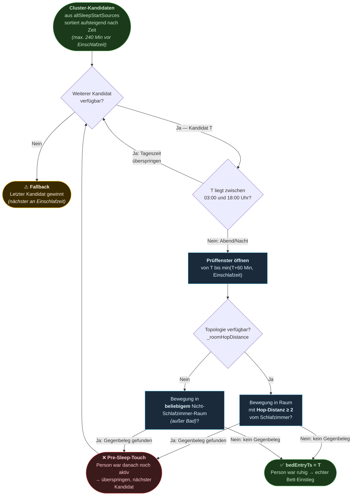
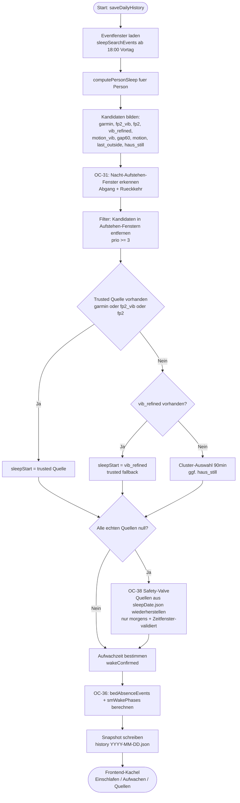
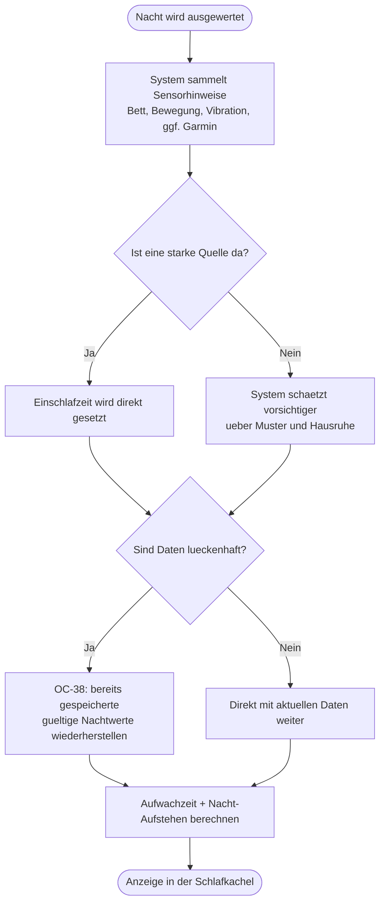

# HANDBUCH — ioBroker Cogni-Living (AURA)
**Zweck:** Algorithmus-Dokumentation, wissenschaftliche Grundlagen, Bedienungsanleitung-Basis.  
**Regel:** Neue Features hier dokumentieren, Tooltips im Frontend als Kurzfassung.  
**Nicht hier:** Deploy-Schritte, Bugfixes → PROJEKT_STATUS.md | Ideen → BRAINSTORMING.md | Krankheits-Matrix → KRANKHEITSBILD-MATRIX.md | Paper → LITERATUR.md

---

## 🗺️ SYSTEM-ARCHITEKTUR (Interaktives Diagramm)

Das vollständige Architektur-Diagramm (Sensoren → Algorithmen → UI-Tabs) ist als interaktives Cursor-Canvas verfügbar.

**Öffnen:** Datei direkt in Cursor anklicken:
```
C:\Users\MarcJaeger\.cursor\projects\c-ioBroker-ioBroker-cogni-living\canvases\aura-system-architecture.canvas.tsx
```

**Was das Diagramm zeigt:**
- Alle Sensoren, Algorithmen und UI-Tabs auf einen Blick
- Klick auf ein Element → alle Verbindungen werden hervorgehoben
- Klick auf einen Sensor → zeigt welche Algorithmen und Tabs er beeinflusst
- Klick auf einen Algorithmus → zeigt benötigte Sensoren und Ausgabe-Tabs
- Klick auf einen Tab → zeigt alle zugehörigen Algorithmen und Sensoren

**Hinweis:** Das Canvas liegt im Cursor-verwalteten Ordner und kann nicht nach `_internal/` verschoben werden — es würde sonst nicht mehr als interaktives Diagramm gerendert.

---

## 🚨 RECHTLICHER HINWEIS

Diese Software ist **KEIN Medizinprodukt** gemäß der Verordnung (EU) 2017/745 (MDR).

- **Zweckbestimmung:** Cogni-Living dient ausschließlich der Unterstützung der allgemeinen Lebensführung (Ambient Assisted Living), dem Komfort und reinen Informationszwecken.
- **Keine Diagnose/Therapie:** Die bereitgestellten Daten, Analysen, Gesundheits-Scores und Alarme sind nicht dazu geeignet, Krankheiten zu diagnostizieren, zu behandeln, zu heilen oder zu verhindern. Sie ersetzen keinesfalls die fachliche Beratung, Diagnose oder Behandlung durch einen Arzt.
- **Haftungsausschluss:** Verlassen Sie sich in gesundheitlichen Notfällen nicht auf diese Software.

---

## 👨‍👩‍👧 Gesundheitsüberwachung für Angehörige (NUUKANNI / Care)

> **Stand:** 13.06.2026 · Dieser Abschnitt beschreibt, **was Sie als Nutzer oder Angehöriger** mit dem System tun können.  
> Technische Profil-Matrix und Literatur: `_internal/KRANKHEITSBILD-MATRIX.md`, `_internal/LITERATUR.md`

### Was AURA für Sie tut (einfach erklärt)

Das Haus beobachtet **diskret** den normalen Tagesablauf: Wann ist jemand unterwegs? Wie war die Nacht? Wird langsamer gelaufen?  
Wenn etwas **ungewöhnlich** ist, sehen Sie das in der App — **ohne** dass Papa eine Uhr tragen oder etwas bedienen muss.

**Wichtig:** Das ist **kein Arzt** und **kein Notrufdienst**. Es ist ein **Hinweis**, dass Sie vielleicht anrufen oder vorbeischauen sollten.

### Was Sie heute schon nutzen können

| Wo | Was Sie sehen |
|---|---|
| **NUUKANNI Familien-App (PWA)** | Tages-Status (unauffällig / leicht auffällig / auffällig), Schlaf der letzten Nacht, Aktivität, Bad-Nutzung |
| **Admin → Medizinisch** | Krankheitsprofile aktivieren, Sensor-Bereitschaft prüfen, Screening-Hinweise (wenn Daten da sind) |
| **Admin → System** | Sensor-Ampel, ob alle Melder erreichbar sind |

### Wann bekommen Sie eine Nachricht aufs Handy?

| Alarm | Wann | Push möglich? |
|---|---|---|
| **Lebenszeichen / Totmann** | Lange keine Bewegung, obwohl normalerweise jemand aktiv wäre | **Ja** — Pushover oder Telegram in den Einstellungen aktivieren |
| **Sicherheits-Alarm** | Urlaubsmodus, Einbruch-Verdacht | **Ja** — je nach Konfiguration |
| **„Heute ungewöhnlicher Tag"** (Tages-Anomalie) | Der Tagesablauf weicht stark vom Normalzustand ab | **In der App sichtbar** — automatischer Push an Angehörige ist **Roadmap** (siehe unten) |
| **„Schleichende Verschlechterung"** über Wochen | Trends, Krankheits-Scores | In App/Admin — **kein** Standard-Push |

**Einrichtung Push (Lebenszeichen & Sicherheit):**  
Einstellungen → Benachrichtigungen → Pushover-Instanz und/oder Telegram aktivieren. Testnachricht senden.

### Typisches Szenario: Papa lebt allein

- **Das Haus kann merken:** Heute läuft alles anders als sonst; die Nacht war unruhig; seit Stunden keine Bewegung.
- **Das Haus kann nicht sicher sagen:** „Papa hat eine Hirnblutung" oder „Papa ist verwirrt" — dafür gibt es **kein** eigenes Profil.
- **Was Sie tun sollten:** Bei **plötzlicher Verwirrtheit oder Notfall immer 112 / Arzt** — die App ist eine **Ergänzung**, kein Ersatz.
- **Was kommt (geplant):** Push an Angehörige bei auffälligem Tag: *„Bei Papa war heute der Ablauf ungewöhnlich — bitte einmal nachfragen."* → Konzept **OC-58** in `BRAINSTORMING.md`.

### Krankheitsprofile im Medizinisch-Tab

1. Profil aktivieren (z. B. Sturzrisiko, Demenz, Schlaf).
2. **Sensor-Bereitschaft** prüfen (grün = Sensoren da; **nicht** „Krankheit sicher erkannt").
3. Nach mindestens **5–14 Tagen** Lernphase Trends und Hinweise lesen.
4. Bei auffälligen Werten: **Arzt oder Pflegedienst** — nicht nur App.

Details aller Profile (Entwicklungsstand, Marketing-Formulierungen): `_internal/KRANKHEITSBILD-MATRIX.md` (intern).

---

## 🗂️ FRONTEND-KACHELN INVENTAR — Alle Tooltip-Texte (1:1 aus Code)

Status: ✅ = Tooltip vorhanden | ⚠️ = Kein Tooltip (TODO)

---

### Tab: Sex (OC-SEX) — Intimitätserkennung & Training

> **Stand:** v0.33.144 | **Kein Medizinprodukt** — ausschließlich zur persönlichen Dokumentation.

---

#### Wie funktioniert die Erkennung?

AURA erkennt intime Aktivitäten anhand des **Vibrationssensors am Bett** (Aqara/FP2). Die Erkennung läuft automatisch und wertet **den gesamten Kalendertag (00:00–23:59)** aus — Sex kann zu jeder Tageszeit passieren.

**Drei Erkennungs-Stufen:**

| Stufe | Methode | Was sie macht |
|---|---|---|
| **1 — Schwellen** | Kalibrierung | Bestimmt calibA (vaginal) und calibB (oral/Hand) aus Trainings-Labels |
| **2 — Klassifikation** | Peak + Dauer | Tier A (hoher Peak, kurz-intensiv) → vaginal; Tier B (moderater Peak, länger) → oral/Hand; Default → nicht klassifiziert |
| **3 — KI-Klassifikator** | Random Forest (Python) | Verfeinert Ergebnis mit Kontextdaten; benötigt mind. 3 gelabelte Sessions |

**Score (0–100):** Gewichtung aus Vibrationsstärke (50%), Trigger-Dichte (30%) und Dauer (20%). Optionaler Garmin-HR-Boost (+10/+15 Punkte bei erhöhter Herzfrequenz in Ruhe).

---

#### Kacheln im Überblick

| Kachel | Funktion |
|---|---|
| **SEX — HEUTE** | Zeigt heutige Session(s) mit Intensitätsverlauf (00:00–23:59). Grau schraffiert = noch nicht vergangen. Titel zeigt Datum. |
| **SEX — 7 TAGE** | Wochenübersicht mit Session-Dots. Zeigt Anz. Sessions, Ø Dauer, Score. Nullnummer-Tage zählen nicht mit. |
| **SEX — MONATSKALENDER** | Monatsübersicht mit Icons. Volle Opazität = Sensor erkannt. Blass (60%) = nur manuell eingetragen. |
| **SESSION EINTRAGEN (für Sensor-Training)** | Manuelles Labeln erkannter Sessions für das KI-Training. **Nicht** für neue Sessions gedacht — dafür "Manuelle Session". |
| **MANUELLE SESSION** | Dokumentiert Intimität außerhalb des Bettes (z. B. Sofa, Reise). Fließt **nicht** ins ML-Training ein. |
| **SENSOR-DETAILS** | Technische Rohdaten der Sensorereignisse der ausgewählten Session. |
| **ALGORITHMUS** | Kalibrierungsstatus, Erkennungs-Schwellen und KI-Klassifikator-Status. |

**Kalender-Icons:**

| Icon | Bedeutung |
|---|---|
| 🌹 (voll) | Vaginal — vom Sensor erkannt |
| 🌹 (blass) | Vaginal — nur manuell eingetragen |
| 💋 (voll) | Oral/Hand — vom Sensor erkannt |
| 💋 (blass) | Oral/Hand — nur manuell eingetragen |
| ❔ | Nicht klassifiziert (erkannt, aber Typ unklar) |
| 🚫 | Nullnummer — Fehlauslösung, zählt nicht als Session |
| ⚡×2 | 2 erkannte Fragmente (Sensor teilte Session auf) |
| +m | Zusätzlich manueller Eintrag vorhanden |

---

#### Nullnummer — Was bedeutet das und was passiert?

Eine **Nullnummer** meldet dem System: *"Der Sensor hat etwas erkannt, aber es war kein Sex"* (z. B. Einschlaf-Unruhe, Bett beziehen, intensives Wälzen).

**Was beim Klick auf „🚫 Nullnummer“ passiert:**
1. Ein Label `nullnummer` wird in den Trainings-Daten gespeichert
2. Das erkannte Event wird **sofort aus der JSON-Datei gelöscht** (`intimacyEvents = []`) — nicht nur visuell versteckt
3. Monatskalender und 7-Tage-Ansicht zeigen den Tag nicht mehr als Sex-Tag (zählt nicht in Wochenstatistik)
4. Der RF-Klassifikator (Stufe 3) lernt dieses Muster als "kein Sex" — ähnliche Fehlerkennungen werden zukünftig verhindert
5. **Kein Einfluss** auf Schlaf-Erkennung, Gesundheits-Algorithmen, Schutzengel oder Morning Briefing
6. **Kein Einfluss** auf calibA/calibB — Vibrations-Schwellen werden nicht verändert
7. Rohe Vibrationsdaten (`eventHistory`) bleiben unverändert erhalten

**Rückgängig:** Über den „↩ Zurück“-Button wird das Label entfernt. Das Event kann dann durch „Neu analysieren“ aus den Rohdaten wiederhergestellt werden.

---

#### Zyklus-Tab: Einfluss auf den Sex-Tab

Der **Zyklus-Tab hat nur minimalen Einfluss** auf den Sex-Tab. Es gibt keine algorithmische Verknüpfung:

| Was | Einfluss |
|---|---|
| **Fun-Kommentare** (Fun Mode aktiv) | Kontextuelle Anmerkungen zur Zyklusphase (z. B. "PMS-Phase Tag 12 — trotzdem intime Aktivität"). Rein informativ, kein algorithmischer Einfluss. |
| **Session-Erkennung (Stufen 1–2)** | ❌ Kein Einfluss — Zyklusdaten fließen nicht in Vibrations-Schwellen oder Session-Erkennung ein. |
| **KI-Klassifikator (Stufe 3)** | ❌ Kein Einfluss — Kontextmerkmale sind Uhrzeit, Licht, Raumtemperatur, Badnutzung. Kein Zyklus-Merkmal. |

> **Geplant (OC-28):** Verhütungsmethode + Fruchtbarkeits-Kontext — zeigt ob ein Intimitäts-Ereignis in einem "günstigen" oder "risikoreichen" Zeitfenster liegt, abhängig von der eingestellten Verhütungsmethode (Vasektomie, Spirale, Kondome, Kinderwunsch aktiv).

---

#### Manuelle Sessions vs. Trainings-Labels — Unterschied

| | Manuelle Session | Trainings-Label |
|---|---|---|
| **Zweck** | Dokumentation (kein Bett-Sensor vorhanden) | ML-Training des KI-Klassifikators |
| **Einfluss auf KI** | ❌ Nein | ✅ Ja |
| **Im Kalender sichtbar** | ✅ Ja (blass/hohl dargestellt) | Nur als Override wenn Sensor-Event existiert |
| **Wo eintragen** | Kachel "MANUELLE SESSION" | Kachel "SESSION EINTRAGEN (für Sensor-Training)" |

> **Wichtig:** Ein Trainings-Label erzeugt oder verlängert **keinen Sensor-Eintrag**. Es lehrt das KI-Modell, ähnliche zukünftige Vibrationsmuster korrekt zu klassifizieren. Die erkannte Session-Dauer im Vibrationsverlauf basiert ausschließlich auf den Rohdaten des Sensors — nicht auf der eingetragenen Dauer im Label.

> **Warum muss nach "+ SPEICHERN" noch das Diskettensymbol gedrückt werden?** Das Speichern eines Labels schreibt in die Adapter-Konfiguration (`native.sexTrainingLabels`). ioBroker erfordert dafür das Speichern der gesamten Adapter-Config (Diskette), was einen Adapter-Neustart auslöst. Danach einmal "Neu analysieren" drücken, damit das neue Label ins Modell einfließt.

---

#### LOO-Kreuzvalidierung — Warum verbessert Training die Confusion Matrix nicht sofort?

Die **Confusion Matrix** im ALGORITHMUS-Tile wird per Leave-One-Out (LOO) berechnet. Das funktioniert so:

> Für jedes Trainings-Label wird das Modell **ohne genau dieses Label** trainiert und dann gefragt: "Kannst du dieses Label korrekt vorhersagen?"

Das führt zu einem häufigen Missverständnis:

**Beispiel:** Du trägst am 18.04. ein vaginal-Label ein. Das Modell lernt dieses Muster. Im Vibrationsverlauf wird die Session nun korrekt als vaginal erkannt. **Aber in der LOO-Matrix bleibt 18.04. trotzdem ein FN** — weil der LOO-Test absichtlich prüft: "Kann das Modell den 18.04. vorhersagen, *ohne* ihn je gesehen zu haben?"

| | Echtes Modell | LOO-Test |
|---|---|---|
| Trainiert auf dem neuen Label? | ✅ Ja | ❌ Nein (absichtlich ausgelassen) |
| Klassifiziert die Session korrekt? | ✅ Ja | ❌ Solange zu wenig ähnliche Samples |
| Zweck | Echte Vorhersagen | Generalisierungsmessung |

**Das ist kein Fehler** — der LOO-Test misst ehrlich, wie gut das Modell auf *unbekannte* Sessions generalisiert. Ein FN für ein neues Label bedeutet: "Ich brauche noch mehr ähnliche Beispiele, um dieses Muster allgemein zu erkennen." Mit mehr vaginal-Sessions ähnlichen Profils wird der Eintrag automatisch zu TP.

---

#### Technische Details (Entwickler)

- **Datenspeicherung:** `intimacyEvents` in `{date}.json` (History-Verzeichnis); manuelle Sessions in `sex-manual.json`
- **Trainings-Labels:** `native.sexTrainingLabels` (JSON-Array in Adapter-Config). Typen: `vaginal`, `oral_hand`, `nullnummer`
- **Tagesgrenze:** Kalender-Tag 00:00–23:59 (ab v0.33.143; vorher Schlafzyklus 18:00–18:00)
- **Neu analysieren:** `reanalyzeSexDay(date)` — respektiert Nullnummer-Labels (überschreibt nicht)
- **Alle analysieren:** Sequenzielle `reanalyzeSexDay`-Aufrufe für alle historischen Tage; nach Kalender-Tag-Umstellung einmalig ausführen
- **Nullnummer löschen:** Handler `clearIntimacyEventsForDay(date)` schreibt `intimacyEvents = []` direkt in die JSON

#### Confusion Matrix und LOO-Details

Die **Confusion Matrix** im ALGORITHMUS-Tile zeigt, wie gut das Modell trainiert ist:

| Feld | Bedeutung |
|---|---|
| **TP** (Grün) | Echte Sex-Session korrekt erkannt |
| **TN** (Grün) | Nullnummer korrekt als kein Sex erkannt |
| **FP** (Rot) | Nullnummer fälschlicherweise als Sex erkannt |
| **FN** (Rot) | Echte Sex-Session als kein Sex klassifiziert |

- **Sensitivität** = TP/(TP+FN) — "Wie oft erkennt das Modell Sex richtig?"
- **Spezifität** = TN/(TN+FP) — "Wie oft erkennt das Modell Nullnummern richtig?"

**LOO-Details aufklappen:** Unter der Matrix gibt es eine ausklappbare Tabelle mit allen Trainings-Sessions, dem vorhergesagten und dem tatsächlichen Typ sowie ob die Einschätzung korrekt war. So siehst du genau, welche Session vom Modell falsch eingeschätzt wurde.

#### Sensor-Konfiguration für den KI-Klassifikator

Die Kontextmerkmale werden **automatisch** aus den vorhandenen Sensoren bezogen — keine spezielle Konfiguration nötig:

| Merkmal | Sensor-Quelle |
|---|---|
| **Licht war an** | Licht-/Dimmer-Sensor im **gleichen Raum** wie der Bett-Sensor |
| **Raumtemperatur** | Temperatur-/Thermostat-Sensor im **gleichen Raum** wie der Bett-Sensor |
| **Anwesenheit** | FP2/Presence-Sensor (unabhängig von Raum) |
| **Bad vor/nach Session** | Alle Sensoren mit Funktion `bathroom` (z.B. EG WC + EG Bad) |
| **Nachbarzimmer aktiv** | Bewegungssensoren in direkt angrenzenden Räumen (Hop=1 im Raumlayout) |
| **Uhrzeit** | Aus dem Session-Startzeitpunkt berechnet (sin/cos-Encoding) |

> **Wichtig:** Für Licht und Temperatur wird der **Raum des Bett-Sensors** verwendet (z.B. "Schlafzimmer"). Es muss kein Sensor speziell als "bed" konfiguriert werden — nur der Raum muss übereinstimmen. Der Tooltip über den Einflussfaktoren zeigt, welcher Sensor konkret gefunden wurde.
### Tab: Gesundheit — Langzeit-Trends (`LongtermTrendsView.tsx`)

Tooltips werden über die `ChartHelp`-Komponente angezeigt (kleines ?-Icon rechts neben dem Kacheltitel).

#### AKTIVITÄT
✅ `src: LongtermTrendsView.tsx Zeile ~573`
> Zeigt deine tägliche Bewegungsintensität im Vergleich zu deinem persönlichen Durchschnitt (= 100%). Hellblau = Tageswert, Grau = 7-Tage-Trend. Grüne Zone (60–140%) ist dein Normalbereich. Werte unter 60% oder über 140% deuten auf unübliche Aktivität hin – z.B. Krankheit oder besonders aktive Tage.

#### GANGGESCHWINDIGKEIT
✅ `src: LongtermTrendsView.tsx Zeile ~661`
> Misst wie lange du durchschnittlich brauchst, um den Flur zu durchqueren (Median in Sekunden). Eine länger werdende Durchquerungszeit kann auf nachlassende Mobilität hinweisen. Typischer Normalbereich: 3–15 Sekunden. Nur Sensoren die als Flur markiert sind werden berücksichtigt.

#### NACHT-UNRUHE
✅ `src: LongtermTrendsView.tsx Zeile ~686`
> Zählt Bewegungsereignisse zwischen 22:00 und 08:00 Uhr in Schlafräumen. Viele Ereignisse deuten auf unruhigen Schlaf oder häufiges Aufstehen hin. Nur Sensoren die als Nacht markiert sind werden berücksichtigt. Der Trend vergleicht die letzten 7 Tage mit dem 4-Wochen-Durchschnitt.

#### RAUM-MOBILITÄT
✅ `src: LongtermTrendsView.tsx Zeile ~716`
> Zeigt in wie vielen verschiedenen Räumen du dich pro Tag bewegt hast. Wenige besuchte Räume können ein Zeichen von eingeschränkter Mobilität sein. Im Tooltip siehst du für jeden Raum wie viele Minuten aktive Bewegung registriert wurde. Alle Bewegungssensoren außer Nacht-Sensoren werden berücksichtigt.

#### DRIFT-MONITOR
✅ `src: LongtermTrendsView.tsx Zeile ~750`
> Erkennt schleichende Veränderungen über Wochen und Monate (Page-Hinkley-Test). Jede Kurve zeigt wie weit sich eine Metrik von ihrer persönlichen Baseline entfernt hat – in Prozent der Alarmschwelle. 0 % = kein Drift, 100 % = Alarm. Die ersten 7–14 Tage sind Kalibrierungsphase (Score = 0). Farben sind identisch mit den Einzelkacheln darüber.

#### BAD-NUTZUNG (Langzeit)
✅ `src: LongtermTrendsView.tsx Zeile ~928`
> Zählt die Minuten täglicher Bewegungsaktivität im Badezimmer. Eine starke Zu- oder Abnahme kann hygienische Gewohnheitsänderungen anzeigen. Nur Sensoren die als Bad markiert sind werden berücksichtigt. Thermostat-Sensoren werden nicht mitgezählt.

#### FRISCHLUFT (Langzeit)
✅ `src: LongtermTrendsView.tsx Zeile ~953`
> Zählt wie oft Fenster oder Türen pro Tag geöffnet wurden. Regelmäßiges Lüften ist wichtig für Wohlbefinden und Gesundheit. Nur Kontaktsensoren vom Typ Tür werden gezählt. Im Tooltip siehst du welche Fenster und Türen besonders häufig geöffnet wurden.

#### BETTPRÄSENZ (Schlaf & Sensorik)
✅ `src: LongtermTrendsView.tsx Zeile ~1044`
> Zeigt wie viele Stunden pro Nacht die Bett-Zone des FP2 belegt war. Grün = 6–9h (optimal), Gelb = 4–6h (wenig), Rot = unter 4h oder über 10h (auffällig). Nur wenn FP2 mit Funktion 'Bett/Schlafzimmer' konfiguriert ist.

#### NACHT-VIBRATION (Schlaf & Sensorik)
✅ `src: LongtermTrendsView.tsx Zeile ~1102`
> Zählt Vibrationsimpulse am Bett zwischen 22:00 und 06:00 Uhr. Viele Impulse deuten auf unruhigen Schlaf hin. Relevant für: Schlafstörungen, Parkinson-Tremor (nächtlich), REM-Schlafstörung. Nur wenn Vibrationssensor mit Funktion 'Bett/Schlafzimmer' konfiguriert ist.

#### PERSONEN-COUNT (Schlaf & Sensorik)
✅ `src: LongtermTrendsView.tsx Zeile ~1141`
> Zeigt das tägliche Maximum gleichzeitig erkannter Personen (FP2 Wohnzimmer). 1 = alleine, 2+ = Mehrpersonen-Haushalt an diesem Tag. Wichtig für: Soziale Isolation, korrekte Einordnung anderer Metriken (z.B. Nacht-Unruhe bei Gast). Nur wenn FP2 mit Funktion 'Wohnzimmer/Hauptraum' konfiguriert ist.

#### NYKTURIE (Schlaf & Sensorik)
✅ `src: LongtermTrendsView.tsx Zeile ~1255`
> Zählt Toilettenbesuche innerhalb des tatsächlichen Schlaf-Fensters (FP2-Bett-basiert). Ohne FP2: Fixfenster 22–06 Uhr. >2 Besuche/Nacht = Nykturie-Hinweis. Frühzeichen bei Diabetes T2, Herzinsuffizienz, Harnwegsinfekt. Nur wenn Bad-Sensor mit Funktion Bad/WC konfiguriert ist.

#### VIBRATIONSSTÄRKE (Schlaf & Sensorik)
✅ `src: LongtermTrendsView.tsx Zeile ~1312`
> Durchschnittliche und maximale Vibrationsstärke im Schlaffenster. Hohe Werte (>80) können auf Parkinson-Tremor, Epilepsie oder intensive Schlafbewegungen hinweisen. Niedriger Count + hohe Stärke = medizinisch relevant.

#### SCHLAFZEITEN (Schlaf & Sensorik)
✅ `src: LongtermTrendsView.tsx Zeile ~1384`
> Zeigt Einschlaf- und Aufwachzeit pro Nacht (FP2-Bett). Konsistente Schlafzeiten fördern Gesundheit. Verschobene Zeiten können auf Depression, Demenz oder Schlafstörungen hinweisen.

---

### Tab: Gesundheit — Tagesansicht (`HealthTab.tsx`)

Tooltips werden über `TerminalBox helpText=` angezeigt (?-Icon im Kachel-Titel).

#### SCHLAF-RADAR (22–08)
✅ `src: HealthTab.tsx Zeile ~991`
> Balkendiagramm der Nacht-Aktivität (22–08 Uhr). Jeder Balken = 30 Minuten. Hohe Balken = viele Bewegungen. Grün = normal, Rot/Orange = auffällig viel. Hilft Schlafmuster zu erkennen.

#### NEURO-TIMELINE (08–22)
✅ `src: HealthTab.tsx Zeile ~1066`
> Stündliche Tages-Aktivität (08–22 Uhr). Blau = keine Aktivität, Grün = normal, Gelb/Rot = erhöht. Zeigt Tagesstruktur und Aktivitätsmuster auf einen Blick.

#### SCHLAFANALYSE (OC-7)
✅ `src: HealthTab.tsx Zeile ~1184`
> AURA-Sleepscore: Tief×200 + REM×150 + Leicht×80 - Wach×250 (Anzeige max. 100, Rohwert kann höher sein). Bonus +5 bei 7–9h Schlafdauer.
> Quellen: Diekelmann & Born 2010 (Tiefschlaf), Walker 2017 / Stickgold 2005 (REM), AASM Guidelines (Leichtschlaf), Buysse et al. 1989 PSQI (WASO-Abzug).
> Einschlafzeit (📡): Letzte FP2-Bettbelegung =10 Min zwischen 18–03 Uhr.
> Aufwachzeit (📡): Erste Bettleere =15 Min nach 04 Uhr (? vorläufig bis 10:00 Uhr + 1h Bett leer).
> Balkenfarben: Dunkelblau=Tief, Hellblau=Leicht, Lila=REM, Gelb=Wach-im-Bett, Orange=Bad-Besuch, Rot=Außerhalb (du), Blau=Andere Person.
> Dreiecks-Marker ?: Orange=Bad, Rot=Außerhalb (bestätigt du), Blau=Andere Person im Haus. Mehrpersonenhaushalt: Rot nur mit FP2-Bett-Bestätigung.
> **FP2-Solo-Dropout-Filter (ab v0.33.103):** Kurze FP2-Abwesenheiten <5 Min, die NICHT durch einen Sensor außerhalb des Schlafzimmers bestätigt werden, erzeugen kein rotes Dreieck. Hintergrund: Der FP2 kann bei ruhiger Schlafhaltung kurzzeitig die Detektion verlieren (Radar-Dropout), obwohl die Person noch im Bett liegt. Ohne Bestätigung durch Bad/Wohnzimmer/anderen Raum-Sensor wird dieses Signal ignoriert.
> Kein Medizinprodukt — für klinische Diagnose Arzt hinzuziehen.

---

## 📐 ALGORITHMUS-DOKUMENTATION — SCHLAFANALYSE (OC-7)

### Wie AURA Einschlaf- und Aufwachzeit bestimmt

AURA kombiniert mehrere Sensordatenquellen nach einem **Prioritätsprinzip (Graceful Degradation)**. Je mehr hochwertige Sensoren vorhanden sind, desto genauer die Erkennung. Das System funktioniert aber auch mit nur einem einfachen Bewegungsmelder.

#### Einschlafzeit — Erkennungsquellen (Priorität absteigend)

> **Hinweis:** Gilt für **globale und per-Person-Schlafkacheln identisch** (ab v0.33.140). Die Prioritätskette ist dieselbe; im Mehrpersonenhaushalt werden Ereignisse nach `personTag` gefiltert.
> Neu ab v0.33.58: Vibrations-Verfeinerung — erkennt das **echte Einschlafen** nach dem Ins-Bett-Gehen (Radar + erstes Vibrations-Event mit =20 Min Stille danach, Forward-Scan).
> Neu ab v0.33.141: `last_outside` auch im globalen System verfügbar.
> **Algorithmus-Richtung ab v0.33.150:** Alle Vib-basierten Quellen (`fp2_vib`, `motion_vib`, `vib_refined`) und `gap60` nutzen jetzt einen **Forward-Scan** — suchen das **erste** ruhige Ereignis (= Einschlafen), nicht mehr das letzte (= Morgen-Aufstehen). `Date.now()`-Fallback durch Fenster-Ende (04:00 Uhr) ersetzt.

| Symbol | Quelle (intern) | Anzeigename im UI | Methode | Konfidenz | Status |
|---|---|---|---|---|---|
| ? | `garmin` | **Smartwatch** (Garmin, Fitbit …) | sleepStartTimestampGMT — plausibel wenn 18–04 Uhr UND ? =3h zur Radar-Zeit + Datum-Konsistenz | Maximal | ✅ aktiv |
| 📡 | `fp2_vib` | **Radar + Vibration** | Radar-Bett belegt · **Forward-Scan**: erstes Vib-Event mit =20 Min Stille danach (innerhalb 3h nach FP2-Anker) | Sehr hoch | ✅ aktiv (ab v0.33.58, Forward-Scan ab v0.33.150) |
| 📡 | `fp2` | **Radar (Präsenz-Sensor)** | Letzter Radar-Bett-Event vor =60 Min Lücke (18–03 Uhr) | Hoch | ✅ aktiv |
| 📡 | `motion_vib` | **Bewegungsmelder + Vibration** | PIR-Motion-Fenster als Anker ? **Forward-Scan**: erstes Vib-Event mit =20 Min Stille (innerhalb 3h) | Mittel-Hoch | ✅ aktiv (ab v0.33.80, Forward-Scan ab v0.33.150) |
| 📡 | `vib_refined` | **Letzte Bettbewegung (Vibration)** | Beliebiger Bett-Event als Anker → **Forward-Scan**: erstes Vib-Event mit ≥20 Min Stille; **nur als Bett-Eintrag wenn Radar/FP2 innerhalb ±10 Min bestätigt** (ab v0.33.316) | Mittel | ✅ aktiv (per-Person ab v0.33.139, Radar-Filter ab v0.33.316) |
| ⚠️ | `gap60` | **Schlafzimmer-Aktivitätspause** | Erstes Vib/FP2-Bett-Event vor =60 Min Stille (Forward-Scan, kein Bewegungsmelder) | Mittel | ✅ aktiv (Forward-Scan + isBedroomMotion entfernt ab v0.33.152) |
| 📡 | `last_outside` | **Letzte Außenaktiv.** | Letztes Außen-Event ohne 30-Min-Folgeaktivität → erster Bett-Event danach | Niedrig | ✅ aktiv (global ab v0.33.141) |
| 📡 | `haus_still` | **Haus-wird-still** | **Forward-Scan** auf Nicht-Schlafzimmer-Events: erstes Event vor =60 Min Stille in anderen Räumen (funktioniert für Single & Multi) | Niedrig | ✅ aktiv (Forward-Scan ab v0.33.153) |
| 📡 | `motion` | **Schlafzimmer-Bewegungsmelder** | Letzte Bewegung + danach =30 Min Stille (18–03 Uhr); Fenster-Ende als Fallback statt Date.now() | Niedrig | ✅ aktiv (nur global, Schwelle 30 Min ab v0.33.152) |
| ? | `fixed` | **Fallback 20:00 Uhr** | Festes Fenster 20:00–09:00 Uhr | — | ✅ aktiv (Fallback; `winstart` ab v0.33.152 entfernt) |

**Legende Dropdown-Anzeige:**
- Zeit angezeigt (`HH:MM`) ? Quelle hat Daten für diese Nacht gefunden
- `—` ? Quelle vorhanden aber kein passendes Ereignis in dieser Nacht
- `⚠️ kein Sensor` ? Sensor-Typ ist im System **nicht konfiguriert** (kein Gerät mit diesem Typ + Funktion „bed")
- **Stark ausgegraut** (Opacity 25%) ? kein Sensor; **leicht ausgegraut** (40%) ? Sensor da, aber keine Daten

#### Aufwachzeit — Erkennungsquellen (Priorität absteigend)

> **Neu ab v0.33.141:** Aufwachzeit hat jetzt ebenfalls ein interaktives **Quellen-Dropdown** mit „Wählen"-Button — analog zur Einschlafzeit. Manuelle Korrekturen werden als `override` gespeichert und sind jederzeit zurücksetzbar.
> **Überarbeitet ab v0.33.155:** `fp2`, `fp2_vib`, `fp2_other` und `other` nutzen jetzt den echten **Abgangs-Zeitpunkt** aus dem Bett (nicht mehr Rückkehr-Zeitpunkt oder Garmin-Überschreibung). `other` (Anderer Raum) zeigt die **erste** andere-Raum-Bewegung — nicht mehr die letzte Abfahrt ohne Rückkehr.

| Symbol | Quelle (intern) | Anzeigename | Methode | Konfidenz | Status |
|---|---|---|---|---|---|
| ? | `garmin` | **Smartwatch** | Garmin `sleepEndTimestampGMT` — plausibel wenn 03–14 Uhr | Maximal | ✅ aktiv (ab v0.33.58) |
| 📡 | `fp2_vib` | **Radar + Vibration** | FP2-Abgangzeit (`firstEmpty`) + Vib-Event in den 30 Min **vor** dem Abgang (Aufwach-Vibration) + Außen-Bestätigung | Sehr hoch | ✅ aktiv (Abgangszeit ab v0.33.155) |
| 📡 | `fp2_other` | **Radar + anderer Raum** | FP2-Abgangzeit + **erste** andere-Raum-Bewegung innerhalb 60 Min danach (Forward-Scan) | Sehr hoch | ✅ aktiv (Forward-Scan ab v0.33.155) |
| 📡 | `fp2` | **Radar (Präsenz-Sensor)** | Zeitpunkt als FP2 das Bett **zuerst** =15 Min leer erkannte nach 04:00 Uhr (`firstEmpty` — echter Abgang, nicht Rückkehr) | Hoch | ✅ aktiv (Abgangzeit ab v0.33.155) |
| 📡 | `other` | **Anderer Raum** | **Erste** Bewegung außerhalb Schlafzimmer/Bad nach 04:00 + =3h Schlaf (Forward-Scan; vorher: letzte Abfahrt ohne Rückkehr) | Mittel | ✅ aktiv (Forward-Scan ab v0.33.155) |
| 📡 | `motion` | **Schlafzimmer-Bewegungsmelder** | Erste Bewegung nach 04:00 + =3h Schlaf | Mittel | ✅ aktiv |
| 📡 | `vibration` | **Vibrationssensor (? Konfidenz)** | Letztes Vib-Event in den 30 Min **vor** dem FP2-Abgang ? Konfidenz-Booster, **kein eigenständiger Zeitpunkt** | Konfidenz-Booster | ✅ aktiv (Fenster vor Abgang ab v0.33.155) |
| 📡 | `vib_wake_cluster` | **Vibrations-Cluster (Aufwachmuster)** | Erste dichte Vib-Häufung (≥3 Events in 15 Min) in den letzten 90 Min der Nacht — erkennt Aufwach-Bewegungsmuster ohne Radar/FP2 | Niedrig | ✅ aktiv (ab v0.33.316) |
| 📡 | `vibration_alone` | **Vibrationssensor allein** | Letztes Vib-Event + danach =45 Min Stille | Sehr niedrig | ✅ aktiv |
| ? | `fixed` | **Fallback 20:00 Uhr** | Fixwert 09:00 Uhr | — | ✅ aktiv (Fallback) |
| 📡 | `override` | **Manuell überschrieben** | Manuell per Dropdown gesetzt (zurücksetzbar) | — | ✅ aktiv (ab v0.33.141) |

#### Warum „Anderer Raum" nur im Einpersonenhaushalt?

Wenn mehrere Personen im Haus sind, könnte ein Wohnzimmer-Signal von **einer anderen Person** stammen. Nur wenn das System sicher ist, dass nur eine Person zu Hause ist (FP2-Personenzählung =1 oder Haushaltskonfiguration = „alleine"), kann das Signal eindeutig der überwachten Person zugeordnet werden.

> **Tipp für Kunden:** Im Schlafzimmer und Bad sind Sensoren immer **personengebunden**, weil diese Räume typischerweise nur von einer Person genutzt werden. Ein Badezimmer-Sensor mit konfiguriertem **Personen-Tag** wird auch im Mehrpersonenhaushalt als persönliches Signal gewertet.

#### Technische Details: FP2-Bett-Aufwachzeit (ab v0.33.155)

- **Echter Abgang (`firstEmpty`):** `sleepWindowCalc` gibt jetzt zusätzlich `firstEmpty` zurück — der Zeitpunkt, an dem das Bett nach dem Schlaf **zuerst** für =15 Min leer wurde (nach 04:00). Das ist der echte Aufsteh-Zeitpunkt. Vorher wurde irrtümlich der Rückkehrzeitpunkt (wann die Person ins Bett zurückkam) verwendet.
- **Kein Garmin-Durchsickern:** `fp2WakeTs` in `allWakeSources` zeigt jetzt den rohen FP2-Wert (`firstEmpty`) — nicht mehr den von Garmin überschriebenen `sleepWindowOC7.end`. Garmin gewinnt nur in der Prioritätskette, aber jede Quelle behält ihren eigenständigen Wert im Dropdown.
- **Aufwach-Vibration:** `fp2_vib` sucht Vibrationsereignisse im Fenster **30 Min vor dem Abgang** — das entspricht dem typischen Wachmuster (Person dreht sich, bevor sie aufsteht). Vorher wurde +5 Min nach dem Abgang eingeschlossen, was keine sinnvollen Events liefert.
- **Mehrfaches Zurückkehren:** Bei einem Nutzer der mehrmals ins Bett zurückkehrt, zeigt `fp2` den ersten echten Abgang (erste =15-Min-Leerphase). `other` zeigt wann erstmals ein anderer Raum betreten wurde.

#### Ins-Bett-Zeit — bedEntryTs (OC-48, ab v0.33.251)

`bedEntryTs` ist der Zeitpunkt "Ins Bett gegangen" — also **wann die Person das Bett betreten hat**, um zu schlafen. Das ergibt das gelbe **Wachliegen-Segment** im Schlafbalken (von `bedEntryTs` bis `sleepWindowStart`).

> **Schlafkachel-Header-Layout (ab v0.33.277):** Die vier Kernzeiten sind hierarchisch dargestellt (PWA-Familienansicht + Admin-HealthTab identisch):
> - **Links:** *Ins Bett gegangen* (klein, sekundär, oben) → orange Latenz-Badge `↓ Xh Ymin` (Einschlaf-Latenz = `sleepWindowStart − bedEntryTs`) → **Eingeschlafen** (groß, primär).
> - **Rechts:** **Aufgewacht** (groß, primär, = `sleepWindowEnd`) → orange Latenz-Badge `↓ Xmin` (Aufwach-Latenz = `bedExitTs − sleepWindowEnd`) → *Aufstehen* (klein, sekundär, = `bedExitTs`).
> - **Begründung:** Eingeschlafen/Aufgewacht sind die mit Garmin vergleichbaren Kernzeiten (daher primär/groß). Die beiden Latenz-Badges sind der Mehrwert ggü. Garmin (Liegezeit vor dem Schlaf bzw. nach dem Aufwachen). Fehlt ein Wert (z.B. keine plausible Ins-Bett-Zeit), entfällt Badge/Sekundärzeile bzw. erscheint der Hinweis „kein plausibler Wert gefunden".

> **bedExitTs Walk-Through-Guard (OC-57, ab v0.33.276):** `bedExitTs` (= *Aufstehen*) wird nicht durch einen kurzen PIR-only-Schlafzimmerbesuch nach dem Aufstehen (z.B. Jacke holen) verschoben. Gibt es einen Vibrationssensor und kein FP2, wird `bedExitTs` auf den letzten echten Matratzen-Kontakt begrenzt, sofern die Person danach nachweislich außerhalb des Schlafzimmers aktiv war. Ohne Vibrationssensor / mit FP2 / bei stillem Liegen: kein Eingriff.

> **Wichtig:** `bedEntryTs` ≠ Einschlafzeit (`sleepWindowStart`). Wer um 22:15 ins Bett geht und erst um 00:40 einschläft, hat 2h 25min gelben Balken. `bedEntryTs` markiert den **Beginn des Balken-Starts**, `sleepWindowStart` das Ende des Gelb-Bereichs.

**Das Problem vor OC-48:** Wenn die Person abends kurz die Matratze berührt (Pre-Sleep-Touch), setzte der Algorithmus `bedEntryTs` auf diesen Moment — auch wenn die Person danach noch 2+ Stunden im Wohnzimmer war. Ein 240-Minuten-Cluster-Fenster (nötig für Kunden mit langer Einschlaf-Latenz) fasste Touch und echtes Einschlafen zu einem Cluster zusammen.

**OC-48 — Counterevidence-Filter (ab v0.33.251):**



**Sensor-Hierarchie (Graceful Degradation):**

| Sensorkonfiguration | OC-48 Verhalten |
|---|---|
| Vibration + Bewegungsmelder + Topologie | Exakteste Erkennung: OG-Kinderzimmer o.ä. zählen **nicht** als Gegenbeleg |
| Vibration + Bewegungsmelder (kein Topologie) | Alle Nicht-Schlafzimmer-Bewegungen zählen als Gegenbeleg |
| Nur Vibration (kein PIR, kein FP2) | Kein Gegenbeleg möglich → Fallback auf frühesten Kandidaten (wie vor OC-48) |
| FP2 + Vibration | FP2-basierte Kandidaten werden bevorzugt; Gegenbeleg-Prüfung gleich |

**OC-46 bleibt korrekt:** Wer tatsächlich früh ins Bett geht und ruhig liegt (keine Außen-Bewegungen), hat **keinen Gegenbeleg** → frühes `bedEntryTs` wird korrekt beibehalten.

**Beispiel Nacht 14./15.05.2026:**

| Kandidat | Zeitpunkt | Prüffenster | Gegenbeleg | Ergebnis |
|---|---|---|---|---|
| `vib_refined` | 22:15 | 22:15–23:15 | Wohnzimmer 22:32 (Hop ≥ 2) | ❌ abgelehnt |
| `fp2` | 22:57 | 22:57–23:57 | Wohnzimmer-Aktivität bis ~23:58 | ❌ abgelehnt |
| `fp2_vib` | 00:33 | 00:33–00:40 | keine | ✅ **bedEntryTs = 00:33** |

> **Log-Erkennungsmuster:** Im ioBroker-Log erscheint `[OC-48] bedEntryTs: fp2_vib @ 00:33 (kein Gegenbeleg in 7 Min)` bei korrekter Erkennung, und `[OC-48] bedEntryTs reject: vib_refined @ 22:15 (Gegenbeleg bis 23:15)` bei abgelehnten Kandidaten.

#### OC-48c - Sustained-Absence-Guard (ab v0.33.267, Mehrpersonen ab v0.33.268)

Der OC-48 Counterevidence-Filter schaut nur **60 Min** voraus. Bei kurzem Abend-Bettkontakt (Kuscheln, kurz hinsetzen) gefolgt von **stundenlanger** Wohnzimmer-Aktivitaet, die erst spaeter als 60 Min beginnt, wurde der fruehe Kandidat faelschlich akzeptiert -> langer Phantom-"Wachliegen"-Balken.

**OC-48c (laeuft nach OC-48/OC-45c):** Pruefe das **gesamte** Fenster zwischen `bedEntryTs` und `sleepWindowStart`. Alle Bewegungen ausserhalb des Schlafzimmers (Bad ausgenommen; mit Topologie: Hop >= 2) werden zu Bloecken zusammengefasst (Luecke <= 12 Min = selber Block). Massgeblich ist der **laengste zusammenhaengende Block >= 30 Min**.

- **Kurzer Toiletten-/Kuechengang** (kurzer Block) -> bleibt erhalten, fruehes `bedEntryTs` korrekt.
- **OC-46 (ruhiges Wachliegen)** -> keine Aussen-Bewegung, kein Block -> fruehes `bedEntryTs` bleibt korrekt.

##### OC-48c v2 — bedEntryTs never-null + FP2-Awareness + Vor-Schlaf-Abwesenheit (ab v0.33.317)

**Problem (Mehrpersonenhaushalt):** Im belebten Haushalt sind die >= 30-Min-Aussen-Bloecke fast unvermeidbar — sie stammen aber oft von einer **anderen Person** (z.B. jemand laeuft durchs Wohnzimmer ueber ungetaggte gemeinsame PIR-Sensoren), waehrend die ueberwachte Person laut FP2 durchgehend im Bett liegt. OC-48c hat dann `bedEntryTs` faelschlich verworfen ("kein plausibler Wert"). Auch ein kurzes Einschlaf-Fenster (z.B. 22:26 ins Bett -> 22:58 eingeschlafen = 32 Min) ueberschritt die 30-Min-Schwelle praktisch immer.

**Neues Verhalten ab v0.33.317:** `bedEntryTs` wird **nie mehr verworfen** (kein `null`). Stattdessen entscheidet ein FP2-Cross-Check ueber den laengsten Aussen-Block:

- **FP2 zeigt das Bett waehrend des Blocks DURCHGEHEND belegt** -> die Aktivitaet stammt von einer **anderen Person** -> `bedEntryTs` bleibt erhalten, **keine** Abwesenheit (der gelbe "Ins Bett / Wachliegen"-Balken ist korrekt, denn die Person lag wirklich im Bett).
- **FP2 leer ODER kein FP2 vorhanden** -> die Person war **wirklich draussen** -> `bedEntryTs` bleibt erhalten und der Block wird als **Vor-Schlaf-Abwesenheit** (`preSleepAbsenceEvents`) markiert. Im Balken erscheint dort ein **grau-schraffiertes Segment** ("🚶 Vor dem Einschlafen ausser Bett: HH:MM – HH:MM") statt eines durchgehenden Phantom-Wachliegens.

- **Sensor-neutral / Graceful Degradation:** Ohne FP2/Radar wird der Block immer als Abwesenheit dargestellt (statt wie frueher `bedEntryTs` zu verwerfen). Beide OC-48c-Implementierungen (per-Person und global) verhalten sich identisch.

> Log: `[OC-48c v2] Aussen-Aktivitaet (Block 32 Min) bei FP2-belegtem Bett -> andere Person, bedEntryTs 22:26 behalten` bzw. `[OC-48c v2] Vor-Schlaf-Abwesenheit 00:23-01:02 markiert; bedEntryTs 22:47 behalten`.

#### OC-47b - Vibration-Extension-Abbruch am Morgen (ab v0.33.267)

OC-47 verlaengert die Aufwachzeit ueber die Garmin-Wachzeit hinaus, wenn nach dem Garmin-Wach noch starke Bett-Vibrationen kommen (FP2-blind-Fall: Person doest weiter im Bett). **OC-47b** bricht diese Verlaengerung ab, wenn zwischen Garmin-Wach und der letzten Vibration eine **Bad-/Far-Room-Aktivitaet** liegt: dann war die Person auf (Morgenroutine), die Vibrationen sind kurze **Re-Kontakte** (z.B. aufs Bett setzen) - es bleibt bei der vertrauenswuerdigen Garmin-Wachzeit.

> Log: `[OC-47b] Vibration-Extension abgebrochen: Bad/Far-Room-Aktivitaet nach Garmin-Wach (08:27) -> Vibrationen sind Re-Kontakte, bleibe bei Garmin-Wach.`

---

#### Sonderfälle

- **Nickerchen (?):** Einschlafzeit zwischen 03:00–19:00 Uhr ? als Nickerchen markiert, kein OC-7-Sleepscore.
- **Ungewöhnlich lange Liegezeit (?):** Schlafdauer > 12h ? Hinweis in der Kachel; Konfidenz wird gesenkt (kann Krankheit/Ausfall signalisieren).
- **Sensor-Ausfall:** Wenn alle Vibrationsdaten fehlen (z. B. Zigbee-Ausfall), werden Schlafphasen auf Basis des verfügbaren Zeitfensters neu berechnet sobald der Sensor wieder liefert. Kein dauerhafter Datenverlust.

#### Außerhalb-Bett-Events (outsideBedEvents — ab v0.33.65, erweitert v0.33.74)

Nächtliche Aktivität außerhalb des Betts (Bad, Küche, Wohnzimmer, Diele, …) wird als farbige Dreiecks-Marker und farbige Balken im Schlafbalken sichtbar gemacht.

**Erkennungsquellen (kombiniert, 3 Phasen):**

| Phase | Quelle | Methode | Typ |
|---|---|---|---|
| 1 | FP2-Bett-Radar | Bett wechselt von "belegt" auf "leer" und zurück (exakter Zeitstempel) | Vorrang vor Motion |
| 2 | Alle Nicht-Schlafzimmer-Sensoren | Alle `motion`/`presence_radar_bool` Sensoren die NICHT `isFP2Bed`/`isVibrationBed`/`isBedroomMotion` sind, feuern während Schlaffenster | Fallback + Ergänzung |
| 3 | Merge | FP2-Events haben Vorrang; Motion-Events füllen Lücken wo FP2 nicht reagiert hat | Keine Duplikate |

**Clustering (Phase 2):**
- Events innerhalb von **5 Minuten** ? ein gemeinsames Ereignis (z. B. Bad + kurzes Wohnzimmer)
- **3 Minuten** Puffer nach letztem Event (damit kurze Besuche nicht auf 0 Min schrumpfen)

**Typ-Bestimmung (ab v0.33.74):**

| Typ | Farbe | Bedeutung | Bedingung |
|---|---|---|---|
| `bathroom` | ?? Orange `#ffb300` | Bad-Besuch bestätigt | Bad-Sensor hat gefeuert |
| `outside` | ?? Rot `#e53935` | Bestätigt: du warst außerhalb | Einpersonenhaushalt ODER Mehrpersonenhaushalt + FP2 bestätigt Bett leer |
| `other_person` | ?? Blau `#1e88e5` | Andere Person im Haus aktiv | Mehrpersonenhaushalt + FP2 zeigt Bett noch belegt ODER kein FP2 vorhanden |

**Mehrpersonenhaushalt-Logik (ab v0.33.74):**
- Konfiguration über `householdSize` in Admin-Settings (`single` / `couple` / `family`)
- Mit FP2-Bett-Sensor: Event gilt als `outside` (du) nur wenn FP2 Bett-leer-Periode überlappt
- Ohne FP2-Bett-Sensor: alle Außer-Schlafzimmer-Events ? `other_person` (nicht sicher zuordenbar)

**Dreiecks-Marker (ab v0.33.74):**
- Unicode-Dreiecke `?` / `?` statt kleiner Buchstaben
- Schriftgröße 15px, fettgedruckt — deutlich sichtbar
- Farbe entspricht dem Event-Typ (orange/rot/blau)

**Snapshot-Timing (ab v0.33.74):**
- Cron läuft jetzt um **23:59:59** statt 23:59:00
- Events in der letzten Minute des Tages (z. B. 23:59:52) werden korrekt erfasst

**Schlaf-Radar 22:00–23:59 (ab v0.33.74):**
- Slots 44–47 nutzen `outsideBedEvents` als ergänzende Quelle
- Löst Diskrepanz: OC-7-Balken und Schlaf-Radar zeigen jetzt konsistente Daten für Ereignisse kurz vor Mitternacht

**Freeze-Supplement:**
Wenn ein Snapshot bereits eingefroren war (echte Nacht gespeichert) und `outsideBedEvents` leer ist (z.B. nach Adapter-Neustart), werden die gespeicherten Events aus dem Snapshot wiederverwendet.

**Motion-only Setups (kein Vibrationssensor, kein FP2 — ab v0.33.102):**

Für Häuser **ohne** FP2-Bett-Sensor oder Vibrationssensor (z.B. reine Bewegungsmelder-Setups wie Gondelsheim):
- `_sleepFrozen` wird auch dann aktiviert wenn per-Person `wakeConfirmed = true` (statt auf `sleepStages.length > 0` zu warten)
- Dadurch: historisches Schlaffenster bleibt erhalten wenn abends eine neue Nacht beginnt
- OBE-Erkennung (Phase 2: Bad-Sensor) läuft korrekt mit dem Vornacht-Fenster
- **Keine Schlafphasen-Balken** (kein Sensor dafür), aber **orangene ? Dreiecke** für Bad-Besuche werden angezeigt

**Motion-only "Bett war leer"-Verhalten (ab v0.33.102):**

| Zeitpunkt | Was passiert | Anzeige |
|---|---|---|
| Nachmittag (nach Aufwachen, vor 20:00) | `wakeConfirmed: true`, historisches Fenster korrekt | Schlafzeit + Aufwachzeit korrekt ? |
| Abends (~21:00-23:00, neue Nacht beginnt) | Ohne Fix: `_pSleepStart` springt auf heute Abend ? invertiertes Fenster ? "Bett war leer" | Mit Fix (v0.33.102): historisches Fenster (gestern 18:00 ? heutiger Wachzeitpunkt) ? korrekte Anzeige ? |
| Morgens | Normales Vornacht-Fenster, alles korrekt | ? |

#### AURA-Sleepscore: V2-Formel + Kalibrierung (OC-Score-V2, ab v0.33.98)

**Was der Nutzer in der Kachel sieht:**

```
    [ 80 ]            ? Angezeigter Score (groß, farbig)
  AURA-Sleepscore
  ? kalibriert (21N) ? Statusbadge
  AURA: 89           ? Unkalibrierter Rohwert (nur wenn kalibriert + Abweichung)
  ?? 8h 57min        ? Schlafdauer
  Garmin: 39 (-41)   ? Garmin-Referenz + Delta zum angezeigten Score
```

**Bedeutung der drei Werte:**

| Wert | Bedeutung | Quelle |
|---|---|---|
| **80** (großer Score) | Kalibrierter AURA-Score = AURA-Rohwert + persönlicher Garmin-Offset | `sleepScoreCal` |
| **AURA: 89** | Unkalibrierter AURA-V2-Rohwert, basiert auf Schlafdauer + Sensorphasen | `sleepScore` |
| **Garmin: 39** | Messwert der Smartwatch (HRV + SpO2 + Herzrate + Bewegung) | Garmin-State |

**Warum weichen AURA und Garmin ab?**
Garmin nutzt Hardware-Sensoren (HRV, Puls, SpO2). Ein AURA-Score von 89 bei Garmin 39 zeigt: unsere Sensoren erkennen die Schlafqualität des Nutzers deutlich besser als Garmin ? nach Kalibrierung wird der angezeigte Score (80) dem Garmin-Durchschnitt angenähert.

> **Hinweis:** Ein einzelner sehr niedriger Garmin-Wert (z.B. 39 bei 8h57min Schlaf) kann auf Garmin-spezifische Einflussfaktoren hinweisen (Alkohol, Stressmarker in HRV, Schlafposition). Der kalibrierte AURA-Score ist das Mittel aus N Nächten, nicht nur ein einzelner Abend.

**Statusbadge-Bedeutung:**

| Badge | Status | Bedeutung |
|---|---|---|
| ? unkalibriert (grau) | < 7 Nächte mit Smartwatch | Nur AURA-Rohformel, kein Garmin-Offset |
| ? kalibriert (N/14N) (orange) | 7–13 Nächte | Kalibrierung läuft ein, wird stabiler |
| ? kalibriert (NN) (grün) | = 14 Nächte | Stabile Kalibrierung, Offset zuverlässig |

**Technische Umsetzung (für Entwickler):**
- `sleepScore` = `max(20, min(95, 25 + 0.12 × sleepDurMin))` ± Phasen-Adj (±8 Pkt)
- `sleepScoreCal` = `sleepScore + mean(garmin - aura)` über letzte 60 Nächte mit beiden Scores
- `sleepScoreCalStatus`: `uncalibrated` | `calibrating` (7–13N) | `calibrated` (=14N)
- History: `analysis.health.sleepScoreHistory` — rolling 60 Nächte `{date, aura, garmin}`

---

#### RAUM-NUTZUNG (MOBILITÄT)
⚠️ Kein TerminalBox-Tooltip vorhanden. Einzelne Raumzeilen haben Hover-Titel (`title={...}`) mit Minuten + Trend.
**TODO:** helpText auf der TerminalBox ergänzen.

#### AKTIVITÄTS-HEATMAP (7/30 Tage × 24h)
⚠️ Kein Tooltip vorhanden.
**TODO:** helpText ergänzen.

#### 30/7-TAGE-ÜBERSICHT (Tabelle)
⚠️ Kein Tooltip vorhanden.
**TODO:** helpText ergänzen.

#### 🌙 NACHT-PROTOKOLL
✅ `src: HealthTab.tsx Zeile ~2077`
> Zeigt den KI-generierten Schlafbericht der letzten Nacht (Gemini). Enthält Analyse der Schlafqualität, Bewegungsereignisse zwischen 22:00 und 08:00 Uhr und Vergleich mit dem persönlichen Normalverhalten.

#### ☀️ TAGES-SITUATION
✅ `src: HealthTab.tsx Zeile ~2081`
> KI-generierter Tagesbericht (Gemini). Zusammenfassung der heutigen Aktivitätsmuster, besuchter Räume und auffälliger Ereignisse. Wird täglich aktualisiert.

#### DIAGNOSE & VITALITÄT
✅ `src: HealthTab.tsx Zeile ~2088`
> Zeigt den Gesundheits-Score (0–1). Ein KI-Modell vergleicht dein aktuelles Bewegungsmuster mit deinem persönlichen Normalverhalten. Score unter 0.3 = unauffällig. Das Modell trainiert sich automatisch sobald 7+ Tage Daten vorliegen – bis dahin zeigt es 0.10 (kein Modell).

#### ENERGIE-RESERVE (AKKU)
✅ `src: HealthTab.tsx Zeile ~2117`
> Metapher für das Aktivitätsniveau: Hohe Aktivität = voller Akku. Die Kurve zeigt den Verlauf über den Tag. Rote Zonen = ungewöhnlich hohe oder niedrige Aktivität im Vergleich zum persönlichen Durchschnitt.

#### FRESH AIR
✅ `src: HealthTab.tsx Zeile ~2131`
> Zeigt wie oft heute Tür/Fenster-Sensoren (Typ: Tür/Fenster) geöffnet wurden. Stoßlüftung = mind. 5 Min offen. Empfehlung: 3× täglich =5 Min (Forschungsbasiert: DIN EN 15251, Pettenkofer-Zahl).

#### MAHLZEITEN
✅ `src: HealthTab.tsx Zeile ~2150`
> Schätzt Mahlzeiten-Zeitpunkte anhand von Küchenaktivität. Die Zeiten sind Schätzungen basierend auf Bewegungsmustern, keine exakten Messungen.

#### BAD / HYGIENE (Tagesansicht)
✅ `src: HealthTab.tsx Zeile ~2164`
> Zeigt die heutige Badezimmer-Nutzung in Minuten aktiver Bewegung. Nur als Bad markierte Sensoren werden berücksichtigt. Thermostate werden ignoriert.

---

### Tab: Handbuch (Help.tsx) — In-App-Dokumentation (vollständige Texte)

Das Handbuch ist als aufklappbare Accordion-Sektionen im Admin-Frontend realisiert. Hier die vollständigen Texte 1:1:

---

#### 0. Wichtiger Rechtlicher Hinweis (Disclaimer)

> Diese Software ist KEIN Medizinprodukt gemäß der Verordnung (EU) 2017/745 (MDR).
>
> 1. **Zweckbestimmung:** Cogni-Living dient ausschließlich der Unterstützung der allgemeinen Lebensführung (Ambient Assisted Living), dem Komfort und reinen Informationszwecken.
>
> 2. **Keine Diagnose/Therapie:** Die bereitgestellten Daten, Analysen, Gesundheits-Scores und Alarme sind nicht dazu geeignet, Krankheiten zu diagnostizieren, zu behandeln, zu heilen oder zu verhindern. Sie ersetzen keinesfalls die fachliche Beratung, Diagnose oder Behandlung durch einen Arzt.
>
> 3. **Haftungsausschluss:** Verlassen Sie sich in gesundheitlichen Notfällen nicht auf diese Software. Bei gesundheitlichen Beschwerden konsultieren Sie bitte sofort medizinisches Fachpersonal. Der Entwickler übernimmt keine Haftung für Schäden, die aus der Nutzung, Fehlfunktion oder Interpretation der Daten entstehen.

---

#### 1. Einrichtung & Auto-Discovery

> - **Schritt A: Lizenz & KI** — Geben Sie im Tab 'Einstellungen' Ihren Google Gemini API Key ein.
> - **Schritt B: Sensoren finden** — Nutzen Sie den 'Auto-Discovery Wizard'. Die Erkennung basiert auf einer Heuristik (Gerätenamen, Rollen).
> - **Schritt C: Kontext** — Beschreiben Sie im Feld 'Wohnkontext' die Situation (z.B. 'Rentnerin, 82, lebt allein').

---

#### 2. Sicherheits-Modi

> - **NORMAL** — Standard-Analyse (Inaktivität, Routinen).
> - **URLAUB** — Haus leer. Jede Bewegung ist Alarm.
> - **PARTY / GAST** — Tolerant. Ignoriert späte Zeiten. Reset 04:00 Uhr.

---

#### 3. Die Neuro-Architektur (3-Phasen-Modell)

Das System überwacht die Gesundheit auf drei zeitlichen Ebenen. Jede Ebene adressiert ein spezifisches medizinisches Risiko und nutzt eine eigene technische Erkennungsmethode.

**Phase 1: Der Sofort-Schutz (Ad-Hoc / Realtime)**
> *Medizinisches Ziel:* Erkennung von unmittelbaren Notfällen (z.B. Person stürzt morgens auf dem Weg zur Küche und steht nicht mehr auf).
>
> *Technisches Problem:* Ein starrer Timer ("Alarm nach 12h Inaktivität") ist oft zu langsam. Wenn um 06:00 Uhr Bewegung war, käme der Alarm erst um 18:00 Uhr — viel zu spät.
>
> *Die KI-Lösung ("Erwartungshaltung"):* Das System sendet bei jedem Check (alle 15 min) einen speziellen `dynamicSafetyPrompt` an die KI: "Ist es basierend auf der Uhrzeit verdächtig still? Fehlt eine Routine, die normalerweise jetzt stattfindet?" Beispiel: Es ist 08:30 Uhr. Normalerweise ist jetzt Aktivität im Flur. Heute nicht. ? **Sofortiger Alarm**, obwohl der 12h-Timer noch nicht abgelaufen ist.

**Phase 2: Die Akute Abweichung (STB / 14 Tage)**
> *Medizinisches Ziel:* Erkennung von plötzlich auftretenden Krankheiten (z.B. Harnwegsinfekt, Magen-Darm, akute Schlafstörung).
>
> *Informatik-Logik:* Das System bildet einen gleitenden Durchschnitt der letzten 14 Tage (STB). Vergleich: `Heute` vs. `STB (Ø 14 Tage)`.
>
> *Beispiel:* Baseline (14 Tage): Ø 3 Toilettengänge/Nacht. Heute: 5 Toilettengänge. ? **Warnung:** Signifikante Abweichung vom Kurzzeit-Mittelwert.

**Phase 3: Der Schleichende Drift (LTB / 60 Tage)**
> *Medizinisches Ziel:* Erkennung von langsamen Veränderungen, die im Tagesvergleich untergehen (z.B. abnehmende Mobilität, Vereinsamung, sich verfestigende Schlafstörungen).
>
> *Das Risiko ("Learning Crux"):* Wenn eine Person krank wird und 5 Tage lang 5x nachts aufsteht, darf die KI das nicht sofort als "neues Normal" akzeptieren.
>
> *Die Lösung (Der Anker):* Wir nutzen einen sehr trägen Langzeit-Wert (LTB = 60 Tage). Vergleich: `STB (letzte 2 Wochen)` vs. `LTB (letzte 2 Monate)`. Selbst wenn die letzten 14 Tage (STB) schlecht waren, bleibt der LTB (60 Tage) stabil. Erst wenn ein Zustand über Monate anhält, passt sich der LTB an.

---

#### 4. Der Butler (Komfort & Automation)

> Die KI analysiert Zusammenhänge zwischen Ereignissen. *Beispiel:* "Jeden Morgen um 07:00 Uhr, wenn Bewegung im Flur erkannt wird, schaltet der Bewohner 2 Minuten später das Licht im Bad an."
>
> *Vorschlags-System:* Wenn die KI ein solches Muster über mehrere Tage stabil erkennt (Konfidenz > 80%), generiert sie einen Automatisierungs-Vorschlag.

---

#### 5. Interaktive Alarme (Family Link)

> **?? Telegram (Interaktiv):** Sendet Alarme mit Action-Buttons direkt im Chat:
> - `[? Alles OK (Reset)]`: Setzt den Alarm im System sofort zurück. Die KI lernt, dass dies ein Fehlalarm war.
> - `[?? Rückruf anfordern]`: Sendet eine Bestätigung an das System, dass sich jemand kümmert.
>
> **?? Pushover (Notfall-Sirene):** Dient als "Wecker". Kritische Alarme werden mit Priorität 2 (Emergency) gesendet und müssen in der Pushover-App bestätigt werden ("Acknowledge"), um den Ton zu stoppen.

---

#### 6. Troubleshooting

> - **Sensoren fehlen?** ? Prüfen Sie ioBroker Räume/Funktionen oder nutzen Sie die Whitelist im Wizard.
> - **Status 'N/A'?** ? Drift-Analyse benötigt mind. 30 Tage Daten.
> - **Adapter offline, aber alle Sensoren grün?** → Ab v0.33.213 gibt es eine **zusätzliche Adapter-Prüfung**: AURA erkennt automatisch, welche Smart-Home-Adapter (Zigbee, Homematic, …) für eure konfigurierten Sensoren zuständig sind, und prüft ob diese Adapter noch verbunden sind — unabhängig davon, wann zuletzt ein einzelner Sensor Werte gesendet hat. Fällt z. B. der Zigbee-Coordinator aus, erscheint im System-Tab ein **roter Banner** ("🔴 Adapter nicht verbunden: zigbee.0") — lange bevor die 7-Tage-Einzel-Sensor-Schwelle anschlägt. Außerdem wird automatisch eine Push-Nachricht gesendet (Nachtschutz 22–08 Uhr, max. 1× pro Adapter pro Tag).
> - **Zu viele Sensor-Offline-Pushover?** → Ab v0.33.66 gilt eine Schwelle von **7 Tagen** (statt 1 Tag) für Bewegungsmelder und Präsenzsensoren. Türsensoren und Temperatursensoren haben eigene Schwellen. KNX/Loxone/BACnet-Sensoren werden grundsätzlich nicht überwacht (kabelgebunden, kein Heartbeat erwartet). Pushover während der Nacht (22–08 Uhr) wird automatisch unterdrückt.
> - **Hue / Lampen als "Sensor-Ausfall" gemeldet?** Ab v0.33.133 werden Sensoren vom Typ `light` und `dimmer` komplett aus der Sensor-Gesundheitspruefung ausgeschlossen. Lampen senden nur bei aktivem Schaltvorgang - wer tagelang kein Licht benutzt, wuerde sonst faelschlicherweise eine Ausfall-Meldung bekommen.
> - **Batterie-Warnung nicht sichtbar?** ? Batterie-Discovery läuft alle 12 Stunden. Nach dem ersten Adapter-Start dauert es bis zu 12 Stunden bis die Discovery alle Sensoren gefunden hat. Den aktuellen Status kann man im ioBroker-Objekt `cogni-living.X.system.sensorBatteryStatus` einsehen.
> - **Batterie-State nicht automatisch gefunden?** ? Im Reiter "Einstellungen ? Sensoren ? Batterie-Konfiguration" kann pro Sensor manuell ein Batterie-Objekt-Pfad hinterlegt werden. Der Button "." öffnet den ioBroker-Objektbrowser.

---

#### 6b. Batterie-Monitoring (OC-15, ab v0.33.67)

Das Batterie-Monitoring überwacht alle batteriebetriebenen Sensoren automatisch.

**Discovery-Mechanismus (3-stufig):**
| Stufe | Methode | Beschreibung |
|-------|---------|-------------|
| 1 | Manuelle Konfiguration | Im Feld `batteryStateId` im Sensor-Tab eingetragene ID hat immer Vorrang |
| 2 | Alias-Rekonstruktion | Bei `alias.0.`-Objekten wird via `common.alias.id` das echte Gerät gefunden, dann `.battery` gesucht |
| 3 | Auto-Discovery | Im Gerätepfad (z.B. `zigbee.0.ABCD1234`) wird direkt ein `.battery`-Datenpunkt gesucht |

**Schwellenwerte:**
| Wert | Status | Aktion |
|------|--------|--------|
| > 20 % | Normal | Keine Aktion |
| = 20 % | Warnung | Anzeige im UI (oranges Badge) |
| = 10 % | Kritisch | Rotes Badge + Pushover täglich um 09:00 Uhr |

**Ausgeschlossene Sensoren:** KNX (`knx.`), Loxone (`loxone.`), BACnet (`bacnet.`), Modbus (`modbus.`) — kabelgebundene Protokolle ohne Batterie.

**ioBroker-State:** `cogni-living.X.system.sensorBatteryStatus` (JSON) — enthält für jeden erkannten Sensor: `id`, `stateId`, `level`, `isLow`, `isCritical`, `source`.

**Hinweis:** Batterie-Warnungen haben **keinen Einfluss auf den AURA-Score oder die Konfidenzwertung** — nur UI-Anzeige und Pushover.

---

#### 7. Hybrid-Engine & Installation

> Cogni-Living nutzt eine Hybrid-Architektur (Node.js + Python). Die Installation erfolgt einmalig per SSH-Konsole:
>
> ```bash
> cd /opt/iobroker/node_modules/iobroker.cogni-living
> sudo rm -rf .venv venv
> sudo python3 -m venv .venv
> sudo ./.venv/bin/pip install --upgrade pip setuptools wheel --no-cache-dir
> sudo ./.venv/bin/pip install torch --index-url https://download.pytorch.org/whl/cpu --no-cache-dir
> sudo ./.venv/bin/pip install -r python_service/requirements.txt --no-cache-dir
> sudo chown -R iobroker:iobroker .venv
> ```
>
> Nach Adapter-Neustart sollte erscheinen: `? Python Environment detected & healthy. Ready.`

---

#### 8. Schlafanalyse (OC-7) & AURA-Sleepscore *(ab v0.33.52)*

> Die OC-7-Kachel berechnet aus Vibrationssensor-Daten geschätzte Schlafphasen und einen Gesundheitsscore. Optional wird ein FP2-Präsenzradar oder Bewegungsmelder für präzise Zeiten genutzt.
>
> **Sensor-Anforderungen (Graceful Degradation — beste bis schlechteste Kombination):**
> - ?? **Optimal:** FP2-Radar (Bett) + Vibrationssensor ? präzise Einschlaf-/Aufwachzeit, Phasen, Außerhalb-Events
> - ?? **Gut:** Bewegungsmelder Schlafzimmer (Funktion: Bett/Schlafzimmer) + Vibrationssensor ? Einschlaf-/Aufwachzeit aus letzter/erster Bewegung, Phasen
> - ?? **Eingeschränkt:** Nur Vibrationssensor ? Phasen mit festem 20–09 Uhr Fenster, keine echten Zeiten
> - ? **Minimal:** Kein Raumsensor ? festes Fenster (Schätzung)
> - ? **Kein Sensor:** Kachel zeigt Konfigurationshinweis
>
> **Wichtig für Bewegungsmelder-Nutzer:** Den Sensor in der Sensor-Liste auf Funktion **"Bett / Schlafzimmer"** (lila) setzen — nur dann wird er für die Schlafanalyse genutzt!
>
    > **AURA-Sleepscore Formel:** `Score = Tief% × 200 + REM% × 150 + Leicht% × 80 - Wach% × 250`; Anzeige max. 100 (Rohwert `sleepScoreRaw` kann höher sein und wird im Badge als `? roh: X` sichtbar); Bonus +5 bei 7–9h Schlafdauer.
    >
    > **Dreiecks-Marker (ab v0.33.65):** Nächtliche Bad-/Küchenbesuche erscheinen als farbige Dreiecke im Schlafbalken. Quellen: FP2-Bett-leer-Erkennung (Vorrang) + Bad-/Küchen-Bewegungsmelder (Fallback). Typ bernstein = Bad, orange = Außerhalb.
>
> **Quellen:** Diekelmann & Born 2010 (Tiefschlaf), Walker 2017 / Stickgold 2005 (REM), AASM Guidelines (Leichtschlaf), Buysse et al. 1989 PSQI (WASO-Abzug).
>
> **Sensor-Indikatoren:** ?? FP2-Sensor (genau) | ?? Bewegungsmelder (gut) | ? Schätzung (Fixfenster)
>
> **Aufwachzeit ?/?:** `? vorläufig` bis 10:00 Uhr + 1h Bett leer bestätigt. Danach `? bestätigt`.
>
> **Sleep-Freeze:** Eine bestätigte Nacht (=3h Bettbelegung, Aufwachzeit vor 14:00) wird nicht durch spätere Aktivität oder Mittagsschlaf überschrieben.

---

**Noch fehlend in Help.tsx (TODO):**
- [ ] GANGGESCHWINDIGKEIT: Berechnung, Flursensor-Konfiguration
- [ ] DIAGNOSE & VITALITÄT: ML-Modell-Details, Score-Interpretation
- [ ] DRIFT-MONITOR: Page-Hinkley-Test Erklärung für Laien

### In-App-Handbuch-Dialog (Gesundheits-Tab, Button unten)

Separater Dialog `openDeepDive` mit Kurzfassung, enthält:
- Navigation (TAG/WOCHE/MONAT, LIVE-Modus, Pfeil-Navigation)
- Schlaf-Radar Erklärung (UNRUHE IM SCHLAFZIMMER / NÄCHTLICHE AKTIVITÄT)
- Langzeit-Trends (Aktivitätsbelastung, Ganggeschwindigkeit, Nacht-Unruhe, Raum-Mobilität, Bad-Nutzung, Frischluft-Index)
- Raum-Histogramme (Top 3, Mini-Histogramme, Anomalie-Erkennung)
- Lebenszeichen-Alarm (??/??/??)
- Konfigurationshinweise (Sensor-Liste, Flur-Checkbox, Reporting)

**TODO:** Dialog um OC-7 und Ganggeschwindigkeit-Details erweitern.

### Tab: System / Einstellungen

?? Kein Tooltip in Sensor-Liste, Reporting oder anderen System-Bereichen.
**TODO:** Spalten-Erklärungen (ID, Name, Raum, Typ, Funktion, Aktiviert) als Tooltips ergänzen.

---

### 🎛️ Vibrations-Kalibrierung (OC-VIB-CAL) — System-Tab

*(ab v0.33.288 · Drift-Erkennung ab v0.33.314)*

AURA lernt über mehrere Nächte das **persönliche Vibrationsmuster** deines Bettes und passt die Erkennungsschwellen für Wake, REM und Tiefschlaf automatisch an.

#### Kalibrierungsstatus

| Status | Bedeutung |
|---|---|
| **Unkalibriert** | Weniger als 3 auswertbare Nächte — feste Standardschwellen aktiv |
| **Kalibrierung läuft…** | 3–6 Nächte — erste Anpassungen aktiv, noch nicht stabil |
| **Kalibriert ✓** | 7+ Nächte — persönliche Schwellen stabil und verlässlich |

Der Fortschrittsbalken zeigt `x/7` Nächte bis zur stabilen Kalibrierung.

#### Wie funktioniert die adaptive Kalibrierung?

AURA speichert einen **14-Nächte-Rolling-Buffer**. Jede neue Nacht ersetzt die älteste. Aus diesem Buffer berechnet AURA:

- **Wake-Schwelle** — Vibrationsstärke ab der eine Bewegung als Aufwachen gilt
- **REM-Fenster** — Bereich für leichte Schlafbewegungen (typisch für REM-Phasen)
- **Tief-Trigger** — Wie viele ruhige 5-Minuten-Slots für Tiefschlaf nötig sind

Die Kalibrierung läuft **dauerhaft weiter** — auch nach „Kalibriert ✓". Das bedeutet: Ändert sich das Schlafverhalten saisonal oder durch neue Bettwäsche, passt sich AURA organisch an.

#### Sensor verschoben? — Drift-Erkennung & Reset

Wenn der Vibrationssensor an eine **neue Position** gelegt wird, ändern sich die Vibrationsmuster grundlegend. AURA erkennt das automatisch:

> **Drift-Warnung (gelb):** Erscheint wenn die letzten 2 Nächte beide mehr als das 2,5-fache oder weniger als 35 % des bisherigen Mittelwerts aufweisen. Das deutet stark darauf hin, dass sich der Sensor-Standort verändert hat.

In diesem Fall empfiehlt sich ein **manueller Reset** über den Button „Kalibrierung zurücksetzen". Nach dem Reset startet die Kalibrierung sofort neu (0/7 Nächte).

> **Hinweis:** Der Reset wird absichtlich nicht automatisch ausgelöst — eine unruhige Nacht oder eine Erkältung kann kurzfristig ähnlich aussehen wie ein Sensor-Drift. Ein falscher automatischer Reset würde 7 Nächte Training verlieren. Der Nutzer entscheidet selbst wann ein Reset sinnvoll ist.

#### Toggle: Adaptive Schwellen aktiv/inaktiv

Der Schalter im VIB-CAL Panel deaktiviert die adaptive Kalibrierung. Dann gelten feste Standardschwellen (Wake > 28, REM 12–23, Tiefschlaf bei 0 Vibrationen pro Slot). Nur für Debugging oder wenn Kalibrierungsdaten fehlerhaft wirken.

---

## 📊 SCHLAFANALYSE (OC-7)

### Übersicht

Die OC-7-Kachel berechnet aus **Vibrationssensor-Daten** (Bett) geschätzte Schlafphasen und einen AURA-Sleepscore. Ergänzend werden FP2-Präsenzradar-Daten für die Erkennung von Einschlaf- und Aufwachzeit verwendet.

### Sensor-Konfigurationsebenen (Graceful Degradation)

| Kombination | Sensor-Indikator | Einschlafzeit | Aufwachzeit | Phasen | Außerhalb-Events |
|---|---|---|---|---|---|
| **FP2 + Vibrationssensor** | ?? FP2-Sensor | ? Exakt | ? Exakt | ? Vollständig | ? Ja |
| **Bewegungsmelder (Bett/Schlafzimmer) + Vibrationssensor** | ?? Bewegungsmelder + Vibration | ? Verfeinert via `motion_vib` (Vib + 20 Min Stille) | ?? Erste Bewegung >04:00 | ? Vollständig | ? Nein |
| **Nur Vibrationssensor** | ? Schätzung | ? Fix 20:00 | ? Fix 09:00 | ? Vollständig | ? Nein |
| **Nur FP2** | ?? FP2-Sensor | ? Exakt | ? Exakt | ? Keine | ? Ja |
| **Keine Raumsensoren** | — | — | — | — | — |

**Hinweis:** "Bewegungsmelder Schlafzimmer" = `type: motion` + `sensorFunction: bed` in der Sensor-Liste. Ohne `sensorFunction: bed` wird der Sensor ignoriert.

**Algorithmus Bewegungsmelder-Fallback (ab v0.33.152):**
- **Einschlafzeit ˜** letztes Bewegungs-Event (Schlafzimmer) zwischen 18:00–03:00 Uhr, das von mindestens **30 Minuten** Stille gefolgt wird (vorher: 45 Min; Fenster-Ende 04:00 als Fallback statt Date.now())
- **Aufwachzeit — 2-stufige Erkennung:**
  1. **Primär:** Erste Aktivität in einem *anderen* Raum (Flur, Wohnzimmer, Küche — nicht Schlafzimmer, nicht Bad) nach 04:00 Uhr + =3h seit Einschlafzeit ? sicherster Aufwach-Beweis
  2. **Fallback:** Schlafzimmer-Bewegung nach 04:00 Uhr + =3h + mindestens 20 Minuten danach keine weitere Schlafzimmer-Bewegung ? Person hat sich nicht wieder hingelegt
- **Vorteil gegenüber Fixfenster:** Echte Einschlaf- und Aufwachzeiten statt immer 20:00–09:00
- **Vorteil gegenüber alter Methode:** Toilettengänge kurz vor dem Aufstehen verschieben die Aufwachzeit nicht mehr, da zuerst Aktivität in anderen Räumen gesucht wird
- **Nachteil gegenüber FP2:** Erkennt keine Ruhephasen (liegend ohne Bewegung). Keine Außerhalb-Bett-Events.

**Nykturie-Zählung mit Bewegungsmelder:** `nocturiaCount` (nächtliche Badezimmerbesuche) nutzt dasselbe OC-7-Schlaffenster (FP2 ? Bewegungsmelder ? Fixfenster). Ohne FP2 wird also automatisch das Bewegungsmelder-Fenster für die Nykturie-Auswertung im Medical Tab verwendet.

### Einschlafzeit-Berechnung (FP2-basiert)

**Quelle:** FP2-Bett-Sensor (`type: presence_radar_bool`, `sensorFunction: bed`)

**Algorithmus:**
1. Durchsuche FP2-Events des Vortags ab 18:00 Uhr bis jetzt
2. Suche letzte Bettbelegung = 10 Minuten zwischen 18:00–03:00 Uhr
3. Startzeit dieser Belegung = Einschlafzeit

**Fallback:** Festes Fenster ab 20:00 Uhr (wenn kein FP2 konfiguriert)

### Aufwachzeit-Berechnung (FP2-basiert, ab v0.33.155)

**Algorithmus:**
1. Ab Einschlafzeit: Suche erste Bettleere = 15 Minuten zwischen 04:00–14:00 Uhr
2. Speichere `firstEmpty` = **Abgangszeitpunkt** (Beginn der Leerphase) ? das ist die echte Aufwachzeit
3. Speichere `end` = Endpunkt der Leerphase (Rückkehr oder Date.now()) ? dient als Schlaffenster-Ende für Score-Berechnung

**Zwei Zeitpunkte im System:**

| Variable | Bedeutung | Verwendung |
|---|---|---|
| `firstEmpty` | Wann das Bett zuerst leer wurde (echter Aufsteh-Zeitpunkt) | `fp2WakeTs` in `allWakeSources` |
| `sleepWindowCalc.end` | Wann die Leerphase endete (Rückkehr oder jetzt) | Schlaffenster-Ende für OC-7 Stages + Score |

**Vorläufig ? Final:**
- `? vorläufig` ? solange aktuelle Uhrzeit < 10:00 Uhr ODER < 1h seit Aufwachzeit
- `? bestätigt` ? ab 10:00 Uhr + mindestens 1h kein Bett mehr belegt

### Sleep-Freeze-Mechanismus

Verhindert, dass eine korrekt erkannte Nacht durch spätere Aktivität überschrieben wird:

- Bedingung: `sleepWindowEnd < 14:00 Uhr` AND `bedPresenceMinutes = 180 min`
- Wenn erfüllt: Einschlaf-/Aufwachzeit, Schlafphasen und Score werden eingefroren
- Abendliche Bettaktivität oder Mittagsschlaf überschreiben die Nacht nicht mehr
- ioBroker-Log: `[History] Sleep FROZEN: 23:28-07:36 bedPresMin=496`

### AURA-Sleepscore — Formel und wissenschaftliche Grundlage (V2, ab v0.33.98)

**Formel V2 (Dauer-basiert, kalibriert an AURA vs. Garmin, r=0.886):**
```
durScore    = max(20, min(95, 25 + 0.12 × sleepDurMin))
coverage    = totalStagedMin / sleepDurMin   (max 1.0)
stageAdj    = max(-8, min(8, round((REM% × 30 - Wach% × 50) × coverage)))
sleepScore  = max(0, min(100, round(durScore + stageAdj)))
```

**Kalibrierung an Garmin (nach = 7 Garmin-Nächten):**
```
offset         = mean(garminScore - auraScore) über letzte 60 Nächte
sleepScoreCal  = max(0, min(100, round(sleepScore + offset)))
```

**Begründung V2:**
- Schlafdauer ist mit r=0.886 der stärkste Prädiktor für den Garmin-Score (Analyse 15 Nächte)
- Vibrationssensor überklassifiziert Tiefschlaf (jede Stille = 10 min war früher "Tief") ? Proportions-basierte Formel ergab immer ~100
- REM und Wake bleiben als kleine Adjustierungen (±8 Pkt) erhalten, skaliert nach Coverage des Fensters
- Kalibrierter Score (`sleepScoreCal`) für Smartwatch-Nutzer: korrigiert individuelle Sensor-Eigenschaften (Matratzentyp, Körpergewicht, Partnereffekte)

**Scorebereich V2 (ungefähr):**
| Schlafdauer | Basisscore |
|---|---|
| 4h (240 min) | ~54 |
| 5h (300 min) | ~61 |
| 6h (360 min) | ~68 |
| 7h (420 min) | ~75 |
| 7,5h (450 min) | ~79 |
| 8h (480 min) | ~83 |
| 8,5h (510 min) | ~86 |
| 9h (540 min) | ~90 |

**Vergleich mit Garmin-Score:**
Der Garmin-Score nutzt zusätzlich HRV, Ruheherzrate, SpO2. AURA V2 schätzt den Garmin-Score über Schlafdauer an, da diese r=0.886 Korrelation zeigt. Der kalibrierte AURA-Score (`sleepScoreCal`) korrigiert verbleibende Abweichungen per linearem Offset.

**Status-Badge im Frontend:**
| Badge | Bedeutung |
|---|---|
| ? unkalibriert (grau) | < 7 Garmin-Nächte vorhanden — Rohformel wird angezeigt |
| ? kalibriert (N/14N) (orange) | 7–13 Garmin-Nächte — Kalibrierung läuft ein |
| ? kalibriert (NN) (grün) | = 14 Garmin-Nächte — Stabile Kalibrierung |

### Schlafphasen-Klassifikation (5-Minuten-Slots)

Die Schlafphasen werden in **5-Minuten-Slots** eingeteilt. Kürzere Ereignisse (< 5 min) werden dem übergeordneten Slot zugerechnet und sind im Balken **nicht sichtbar** — systembedingt, kein Fehler.

#### Klassifikationsregeln (Vibrationssensor-basiert)

| Bedingung | Phase |
|---|---|
| 0 Vibrationen im Slot | Leichtschlaf (< 5 ruhige Slots in Folge) |
| 0 Vibrationen, ≥ 5 ruhige Slots in Folge (= 25 min ununterbrochen) | **Tiefschlaf** |
| ≥ 5 Vibrationen ODER Stärke > 28 | Wach |
| ≈ 2 Vibrationen + mittlere Stärke (12–28) + > 2,5h Schlaf | REM (geschätzt) |
| Sonstige Vibration | Leichtschlaf |

#### Mindestdauer für Tiefschlaf: 25 Minuten

**Tiefschlaf wird erst nach 25 Minuten ununterbrochener Ruhe erkannt** (= 5 leere 5-min-Slots in Folge). Das bedeutet:
- Kurze Ruhephasen < 25 min → werden als **Leichtschlaf** gezählt, nicht als Tief
- Einzelne Tiefschlaf-Fragmente (5–10 min) im Balken sind sehr schmal (≈1–2% Balkenbreite) und kaum sichtbar — die Zusammenfassungs-Zahlen unter dem Balken sind zuverlässiger als die visuelle Balkenbreite

#### Mehrquellen-Architektur

Das `sleepStages`-Array kann Einträge von mehreren Quellen (z. B. mehrere Personen oder Sensoren) für denselben Zeitslot enthalten. Der letzte Eintrag je Slot ist im Balken visuell dominant. Die Minuten-Zähler unter dem Balken können dadurch inflationiert sein (Duplikate werden mitgezählt). Bei Abweichungen ist die **Garmin-Referenz** (unterer Bereich der Kachel) der zuverlässigere Wert.

#### Garmin als Referenz (optional)

Wenn eine Garmin-Uhr konfiguriert ist, werden Garmin-eigene Schlafphasen als separate Zeile angezeigt (`garminDeepMin`, `garminLightMin`, `garminRemMin`). Abweichungen zwischen AURA und Garmin sind normal: AURA misst Bettvibrationen, Garmin misst Herzratenvariabilität am Handgelenk. Garmin-Tiefschlaf ist typischerweise geringer als der AURA-Vibrationswert.

### Außerhalb-Bett-Ereignisse

Werden aus FP2-Events während des Schlaffensters berechnet:

| Ereignistyp | Erkennungsmethode | Farbe im Balken |
|---|---|---|
| Bad-Besuch | Bett leer + Bad-Sensor (isBathroomSensor) | Bernstein #ffb300 |
| Außerhalb | Bett leer (kein Bad-Sensor) | Orange-Rot #ff5722 |

**Dreiecks-Marker ? über dem Balken:**
- Gelbes Dreieck = Bad-Besuch
- Rotes Dreieck = Abwesenheit = 20 Minuten

### Bed-Absence-Konsens-Engine (OC-36, ab v0.33.210)

Einfach erklärt: Diese Logik entscheidet, **wann du wirklich aus dem Bett warst**.

Sie kombiniert vier Hinweise:
1. **FP2 am Bett** (zuverlässigster Hinweis)
2. **State Machine** (Bewegungslogik über Raum-Nachbarschaft)
3. **Pattern-Matcher** (typische "raus und wieder zurück"-Muster)
4. **Außenraum-Events** (`outsideBedEvents`)

Danach werden alle Treffer zu einer Liste `bedAbsenceEvents` zusammengeführt.

**Wichtige Schutzregeln (für stabile, alltagstaugliche Anzeige):**
- **Hop-Filter auf alle Außenraum-Typen:** Nur Räume in Schlafzimmer-Nähe werden akzeptiert (OG-Kinderbad wird verworfen).
- **Mindestdauer 5 Minuten:** Sehr kurze Ereignisse erzeugen keinen grauen Block.
- **FP2-Abwesenheit nur nach stabiler Bett-Präsenz:** FP2 muss vorher mindestens 20 Minuten durchgehend "Bett belegt" gesehen haben (Pre-Sleep-Filter).
- **OC-49a BED_TOUCH-Filter (ab v0.33.252):** Nach dem Aufwachen (Post-Wake) reichen bereits **2 Minuten** FP2-Präsenz, um eine echte Rückkehr zu erkennen. Kurze Berührungen unter 2 Minuten (z. B. Bett machen, Kissen holen) gelten als "BED_TOUCH" und unterbrechen eine laufende Abwesenheits-Erfassung **nicht**. So wird z. B. ein 40-Minuten-Zeitraum außerhalb des Bettes korrekt als Außerhalb angezeigt, auch wenn die Person das Bett kurz berührt hat.
- **Safety-Valve für `bedEntryTs` (ab v0.33.212):** `bedEntryTs` wird nur verwendet, wenn er **vor** `sleepStart` liegt. So kann ein heutiger Live-Wert (z. B. abends nach Neustart) nicht mehr die alte Nacht kaputtfiltern.

**So sieht es in der UI aus (verständlich für Anwender):**
- **Grauer schraffierter Balken:** "Weg vom Bett" (eigener Zustand, kein Schlafstadium)
- **Wichtig:** Der graue Block ist **opak** und ersetzt die darunterliegende Schlafphase (keine Farbmischung mehr)
- **Rotes Dreieck:** außerhalb des Schlafzimmers
- **Oranges Dreieck:** Bad-Besuch

**Warum gibt es manchmal kein Dreieck?**
- Wenn die Sensorlage keinen sicheren Beleg liefert, wird bewusst nichts gezeichnet (Lieber nichts als falsch).
- Ohne passende Sensoren funktioniert das System im Fallback-Modus (Graceful Degradation).

**Graceful Degradation (bei unterschiedlichen Kunden-Setups):**
| Sensor-Setup | Verhalten |
|---|---|
| FP2 + Vibration + PIR | Beste Qualität, präzise "Weg vom Bett"-Fenster |
| Vibration + PIR (kein FP2) | Gute Schätzung über Bewegungslogik + Vibration |
| Nur PIR | Grundfunktion, aber vorsichtiger und mit weniger Sicherheit |
| Kein Schlafzimmer-Sensor | Keine "Weg vom Bett"-Blöcke |

**Kompatibilität:** Alte JSON-Dateien ohne `bedAbsenceEvents` bleiben lauffähig; dann greift automatisch das ältere Verhalten.

### Schlafanalyse-Ablaufdiagramm (technisch)



### Schlafanalyse-Ablauf (vereinfacht für Nichttechniker)



### Farbkonzept (Best ? Schlimmste, Usability-Prinzip)

| Farbe | Phase | Hex | Bedeutung |
|---|---|---|---|
| Dunkelblau | Tiefschlaf | #1565c0 | Optimal, restaurativ |
| Hellblau | Leichtschlaf | #42a5f5 | Gut, transitional |
| Lila | REM | #ab47bc | Gut, emotional restaurativ |
| Gelb | Wach im Bett | #ffd54f | Milde Störung |
| Bernstein | Bad-Besuch | #ffb300 | Moderate Störung |
| Orange-Rot | Außerhalb Bett | #ff5722 | Deutliche Störung |

**Grundlage:** Standard UX-Konvention (Rot = schlimmste Farbe). Rot ist für die stärkste Störung reserviert.

### Sensor-Indikator-Symbole

| Symbol | Bedeutung |
|---|---|
| ?? FP2-Sensor | Zeiten aus FP2-Präsenzradar (genau) |
| ?? Bewegungsmelder | Zeiten aus Bewegungsmelder (eingeschränkt) |
| ?? Bewegungsmelder + Vibration | Einschlafzeit via `motion_vib` (kein FP2) |
| ?? Haus-wird-still | Einschlafzeit via Ruhe in Gemeinschaftsbereichen |
| ?? Vibrationssensor | Nur Phasen, Zeiten geschätzt |
| ? Schätzung | Festes Fenster 20:00–09:00 (kein Raumsensor) |

---

## 🔧 SENSOR-KONFIGURATION

### Universalität (Kern-Designprinzip)

AURA muss mit jeder Sensor-Ausstattung funktionieren:
- Kein Sensor ? keine Kachel (kein Fehler)
- Teilausstattung ? eingeschränkter Modus mit Hinweis
- Vollausstattung ? alle Features aktiv

### Sensor-Typen und Funktionen

| Typ (d.type) | Funktion (d.sensorFunction) | Verwendung |
|---|---|---|
| presence_radar_bool | bed | OC-7 Einschlaf-/Aufwachzeit, Bett-Präsenz |
| vibration | bed | OC-7 Schlafphasen-Klassifikation |
| motion | bathroom | OC-7 Bad-Besuch-Erkennung |
| motion | hallway | Ganggeschwindigkeit |
| motion | — | Allgemeine Aktivitätserkennung |

### FP2-Zuverlässigkeit und Sensor-Fusion

**Problem:** FP2 kann bei Tiefschlaf unter dicker Bettdecke Falsch-Negative liefern.

**Sensor-Fusion-Logik:**
```
FP2 = "da"                               ? Im Bett (sicher)
FP2 = "weg" + Vibration kürzlich aktiv   ? Wahrscheinlich noch im Bett
 + KEIN Außensensor                         (FP2 Falsch-Negativ)
FP2 = "weg" + Außensensor aktiv          ? Definitiv außerhalb
FP2 = "weg" + keine Aktivität            ? Tiefer Schlaf ODER aufgestanden
 + kein Außensensor                         (Kontext aus Geschichte)
```

**Einzel- vs. Mehrpersonenhaushalt:**
- Einzelperson: jede Außenbewegung = diese Person
- Mehrpersonen: Außenbewegung kann andere Person sein ? vorsichtigere Interpretation

---

## 📌 SENSOR-VORAUSSETZUNGEN JE SCHLAFKACHEL-ELEMENT

Diese Tabelle beschreibt, welche Sensoren für jedes sichtbare Element der Schlafkachel benötigt werden. Sortiert von **unzuverlässig ? zuverlässig**.

### Schlafbalken (Schlafphasen: Tief / Leicht / REM / Wach)

| Zuverlässigkeit | Sensor-Kombination | Qualität |
|---|---|---|
| Keine | Nur PIR (Bewegungsmelder) | Kein Balken — nur Zeiten |
| Niedrig | Nur FP2-Radar am Bett | Kein Balken — FP2 liefert keine Vibrations-Events |
| Mittel | Vibrationssensor am Bett (allein) | Balken erscheint ab der ersten Nacht. Erste Nacht evtl. verrauscht. |
| Gut | PIR + Vibrationssensor am Bett | Balken + präzisere Einschlafzeit |
| Sehr gut | FP2 + Vibrationssensor am Bett | Balken + genaue Bett-Präsenz + Einschlafzeit |
| Referenz | Garmin-Uhr | Garmin-Stages als Overlay (keine AURA-Stages erforderlich) |

> **Wichtig:** `sensorFunction === 'bed'` und `type === 'vibration_trigger'` oder `vibration_strength` sind Pflicht für den Balken.

### Einschlafzeit / Aufwachzeit

| Zuverlässigkeit | Quelle | Symbol |
|---|---|---|
| Niedrig | Festes Fenster 20:00–09:00 (kein Raumsensor) | ? |
| Niedrig | Fenster-Start Fallback (`winstart`) | ? |
| Mittel | Haus-wird-still (Gemeinschaftsbereiche) | 📡 |
| Mittel | Letzter Außenraum-Sensor dieser Person | 📡 |
| Gut | 60-Min-Bett-Gap via PIR oder Vibrationssensor | ??? |
| Sehr gut | FP2-Radar am Bett (Bett-Präsenz =10 Min) | 📡 |
| Referenz | Garmin-Uhr | ? |

### Außerhalb-Dreiecke ?? (Bad-Besuch / Aufstehen)

| Voraussetzung | Beschreibung |
|---|---|
| **Pflicht:** FP2-Radar am Bett | Nur FP2 kann "Bett leer" zuverlässig erkennen |
| Optional: Bad-Sensor | Unterscheidet Bad-Besuch (bernstein) von sonstigem Aufstehen (orange-rot) |

> Ohne FP2-Radar: keine Dreiecke, unabhängig von anderen Sensoren.

### AURA-Sleepscore

| Voraussetzung | Auswirkung |
|---|---|
| Vibrationssensor am Bett | Score wird berechnet (Tiefschlaf-Anteil zählt 200 Punkte, REM 150) |
| Kein Vibrationssensor | Score basiert nur auf Schlafdauer (75 % Gewichtung) — unvollständig |
| Garmin vorhanden | Garmin-Score wird als lila Referenzpunkt daneben angezeigt |

### Kalibrierungsphase (erste Nächte mit neuem Sensor)

Vibrationssensoren benötigen **keine Lernphase** — Schlafphasen werden ab der ersten Nacht berechnet. Voraussetzung: der Sensor muss während des Schlafs mindestens ~10–20 Vibrationen aufzeichnen (Mindestsensitivität prüfen, falls der Balken leer bleibt).

**Adaptive Kalibrierung (OC-VIB-CAL, ab v0.33.288):** Ab der 3. Nacht passt AURA die Erkennungsschwellen automatisch an das persönliche Vibrationsmuster an. Ab der 7. Nacht sind die Schwellen stabil. Der aktuelle Kalibrierungsfortschritt ist im **System-Tab → Vibrations-Kalibrierung** einsehbar. Wurde der Sensor an eine neue Position gelegt, erscheint dort eine Drift-Warnung mit einem Reset-Button (ab v0.33.314).

**Typische Erstinbetriebnahme-Probleme:**
- Balken leer trotz installiertem Vibrationssensor → Adapter wurde tagsüber neugestartet → Freeze-Schutzmechanismus hat eine leere Nacht eingefroren. Abhilfe: Adapter erneut starten oder bis zur nächsten Nacht warten.
- Wenige Ereignisse (< 5) → Sensor ist zu weit vom Körper entfernt oder Empfindlichkeit zu niedrig.

---

## 📊 OC-10: SCHLAF-SCORE WOCHENANSICHT *(ab v0.33.63)*

### Übersicht

Im AURA MONITOR (Tab „Gesundheit") erscheinen bei Auswahl von **WOCHE** oder **MONAT** zwei neue Diagramme unterhalb der Übersichtstabelle:

### Option A — AURA-Sleepscore (Balken-Chart)

- **Datenbasis:** `snapshot.sleepScore` (0–100) pro Nacht
- **Darstellung:** Ein Balken pro Nacht, farbkodiert:
  - Grün =80 (gut)
  - Orange 60–79 (mittel)
  - Rot <60 (schlecht)
- **Garmin-Overlay:** Lila Punkt auf Balken-Höhe des Garmin-Scores (wenn vorhanden)
- **Kopfzeile:** Durchschnittsscore der angezeigten Nächte

### Option B — Schlafphasen-Anteile (Gestapelter Balken-Chart)

- **Datenbasis:** `snapshot.sleepStages` (Array `[{t, s}]`)
- **Darstellung:** Gestapelter Balken pro Nacht, von oben nach unten:
  - Dunkelblau = Tiefschlaf (`deep`)
  - Hellblau = Leichtschlaf (`light`)
  - Lila = REM-Schlaf (`rem`)
  - Gelb = Wachliegen (`wake`)
- **Score-Linie:** Gestrichelter weißer Overlay-Verlauf des AURA-Scores
- **Kopfzeile:** Durchschnittliche Tief% und REM% der angezeigten Nächte

### Technische Details

- Implementiert in `src-admin/src/components/tabs/HealthTab.tsx`
- Reines SVG (kein recharts), AURA MONITOR Terminal-Stil
- Beide Charts erscheinen nebeneinander (CSS Grid 1fr 1fr)
- Fallback: Nur Score-Chart wenn keine Stages vorhanden (und umgekehrt)
- Zeigt „Keine Schlaf-Score-Daten verfügbar" wenn weder Score noch Stages in den Snapshots

---

## 📚 LITERATURVERZEICHNIS

- Buysse, D.J. et al. (1989). *The Pittsburgh Sleep Quality Index (PSQI)*. Psychiatry Research, 28(2), 193-213.
- Carskadon, M.A. & Dement, W.C. *Normal Human Sleep: An Overview*. In Principles and Practice of Sleep Medicine, AASM.
- Diekelmann, S. & Born, J. (2010). *The memory function of sleep*. Nature Reviews Neuroscience, 11(2), 114-126.
- Stickgold, R. (2005). *Sleep-dependent memory consolidation*. Nature, 437, 1272-1278.
- Walker, M. (2017). *Why We Sleep*. Scribner.

---

## 📋 OFFENE DOKUMENTATIONSTHEMEN

- [x] Dead-Man-Schalter (OC-4): Algorithmus-Dokumentation **v0.33.133**

### Schutzengel (Dead-Man-Schalter, OC-4) — ab v0.33.133

**Zweck:** Erkennt wenn eine Person ungewoehnlich lange in einem Raum verweilt und nicht mehr reagiert (Sturz, Bewusstlosigkeit, medizinischer Notfall).

**Funktionsweise (ab v0.33.133 — Globale Aktivitaetspruefung):**
- Jede Bewegung (PIR, Radar, Tuerkontakt) in IRGENDEINEM konfigurierten Raum setzt den Timer zurueck
- Kein Topologie-Filter mehr: die fruuhere Pruefung "ist Raum B direkt mit Raum A verbunden?" wurde entfernt
- Grund: PIR-Sensoren haben Hold-Times (oft 30-120 Sek.) — beim Verlassen eines Raums kann der Durchgangsraum-Sensor keinen neuen Rising-Edge senden wenn er noch auf "besetzt" steht
- Zusaetzlich: Tuer-Kontakt-Events (type=door) loesen jetzt ebenfalls einen Timer-Reset aus

**Per-Raum-Timeouts:**
| Raumtyp | Standard-Timeout | Erweiterung |
|---------|-----------------|-------------|
| Bad, Bath | 45 Min | +90 Min bei Smart-Sleep-Erkennung |
| WC, Toilette | 30 Min | — |
| Schlafzimmer, Bed | 120 Min | +90 Min nachts/Siesta |
| Keller | 60 Min | — |
| Gaestezimmer | 90 Min | — |
| Alle anderen | kein Timer | (kein Monitoring) |

Individuelle Timeouts konfigurierbar unter: Sicherheit ? Schutzengel ? Raum-Timeouts

**Alarm-Ablauf:**
1. Timer laeuft ab ? Schutzengel-Frage (Pre-Warn) via Pushover
2. Keine Reaktion nach 5 Min ? Notfall-Alarm (Priority 2, muss bestaetigt werden)

**Smart Sleep Erkennung:**
Wenn Uhrzeit + Raum auf Schlaf/Siesta hindeuten (Wahrscheinlichkeit > 65%), wird der Timer automatisch um 90 Minuten verlaengert um Fehlalarme bei Nickerchen zu vermeiden.

- [ ] Ganggeschwindigkeit: Berechnung und Sensor-Anforderungen
- [ ] Nykturie-Erkennung: Definition und Schwellenwerte
- [x] Wochenansicht Sleep-Score: **implementiert v0.33.63** — AURA MONITOR WOCHE/MONAT-View, Option A + B (siehe unten)
- [ ] Handbuch-Tab im Admin-Interface: Inhalte synchron halten

---

*Zuletzt aktualisiert: 16.04.2026 | Version: 0.33.155*


---

## 🚶 Kurzes Aufstehen in der Nacht — wie AURA damit umgeht (ab v0.33.191)

### Was passiert, wenn jemand nachts kurz aufsteht?

Jeder kennt es: Man schläft um 22 Uhr ein, steht kurz nach 2 Uhr auf — Toilette, ein Glas Wasser, eine Tablette — und legt sich wieder hin. Diese kurze Unterbrechung hat mit dem eigentlichen Einschlafen nichts zu tun.

Ohne eine spezielle Erkennung könnte AURA diese Bewegungen aber falsch interpretieren: Der Bewegungsmelder im Flur schlägt um 2:44 Uhr an, der Sensor im Schlafzimmer kurz danach. Für einen "dummen" Algorithmus sieht das aus wie: *"Person hat gerade das Bett verlassen und ist zurückgekommen — vielleicht ist das der Einschlafzeitpunkt."* Ergebnis: AURA zeigt 2:46 Uhr als Einschlafzeit an, obwohl die Person bereits seit 22 Uhr schläft.

### Das Beispiel aus der Praxis (Robert, 21./22.04.2026)

Robert legt sich um **21:30 Uhr** ins Bett. Der Matratzensensor bestätigt das. Um **2:44 Uhr** steht er kurz auf (Flur-Bewegungsmelder schlägt an), um **2:51 Uhr** ist er wieder im Schlafzimmer.

Ohne den Filter: AURA wertet die 2:44-Bewegung als mögliche Einschlafzeit und wählt **2:46 Uhr** — komplett falsch.

Mit dem Filter: AURA erkennt das Muster "kurz raus, kurz rein" und ignoriert diese Zeitspanne. Die Einschlafzeit bleibt bei **21:30 Uhr**.

### Wie erkennt AURA das Muster?

AURA überwacht während der Nacht (21:00–09:00 Uhr) alle Bewegungssensoren im Haus und sucht nach folgendem Muster:

1. **Jemand verlässt das Schlafzimmer** — ein Bewegungsmelder außerhalb des Schlafzimmers schlägt an (Flur, Bad, Küche — maximal 4 "Türen" vom Schlafzimmer entfernt, damit entfernte Räume wie Keller ignoriert werden)
2. **Jemand kehrt innerhalb von 20 Minuten zurück** — der Schlafzimmer-Sensor schlägt wieder an

Wenn dieses Muster erkannt wird, sagt AURA: *"In diesem Zeitraum war jemand kurz auf — alle Sensordaten aus diesem Fenster ignorieren wir für die Einschlafzeit-Berechnung."*

### Was wird ignoriert, was nicht?

Wenn ein solcher kurzer Ausflug erkannt wird, werden Sensordaten aus diesem Zeitraum **nicht** als Einschlafzeitpunkt gewertet — aber nur für weniger zuverlässige Quellen:

| Quelle | Wird gefiltert? | Warum |
|---|---|---|
| Smartwatch (Garmin, Fitbit) | **Nein** | Die Uhr wird durchgehend getragen und erkennt den Schlafzustand unabhängig von Bewegungen im Haus |
| Radar-Sensor (FP2/mmWave) kombiniert | **Nein** | Radar erkennt Atem und Mikrobewegungen — wurde beim Einschlafen kalibriert und ändert sich durch kurzes Aufstehen nicht |
| Radar-Sensor allein | **Nein** | Gleicher Grund |
| Matratzensensor (Vibration verfeinert) | **Ja** | Dieser Sensor misst "wann war die Matratze zuletzt längere Zeit still" — nach einem Aufstehen und Zurücklegen kann dieser Wert zurückgesetzt werden und eine falsche Zeit anzeigen |
| Bewegungsmelder, Lücken-Erkennung, "Haus still" | **Ja** | Diese Quellen sind direkt von den Bewegungen betroffen |

### Was passiert bei längerer Abwesenheit? (OC-31 Stage 2)

Wer länger als 20 Minuten aufbleibt — oder sogar 2 Stunden am PC sitzt — wird von **Stage 2** der Schlafzustandsmaschine erfasst. Hier gilt das Prinzip: **einmal eingeschlafen, immer eingeschlafen** (in dieser Nacht).

**Beispiel:** Robert schläft um 22:08 ein. Um 23:50 geht er zum PC (2 Stunden). Um 02:30 kommt er zurück ins Bett. AURA zeigt:
- Einschlafen: **22:08** (bleibt eingefroren)
- Schlafbalken: 22:08–23:50 Schlaf, 23:50–02:30 **gelber Wachphasen-Block**, ab 02:30 wieder Schlaf
- Schlafeffizienz: korrekt berechnet (PC-Zeit abgezogen)

Stage 2 erkennt dabei beliebig viele Wachphasen pro Nacht (mehrfaches Aufstehen).

### 🛏 Wann bin ich ins Bett gegangen? ("Ins-Bett-Zeit")

Seit v0.33.194 erkennt AURA auch, **wann eine Person das Bett betreten hat** — unabhängig davon, wann sie eingeschlafen ist. Diese "Ins-Bett-Zeit" wird im Schlafbalken als gelbes Segment **vor der Einschlafzeit** dargestellt.

**Warum ist das interessant?**
- Garmin zeigt nur "eingeschlafen um HH:MM" — AURA zeigt zusätzlich "ins Bett um HH:MM"
- Die Differenz = Einschlaf-Latenz ("Wie lange brauche ich zum Einschlafen?")
- Ideal: Einschlaf-Latenz < 20 Min. Regelmäßig > 30 Min kann auf Einschlafprobleme hinweisen.

**Wie wird die Ins-Bett-Zeit erkannt?**

Ab v0.33.198 nutzt AURA einen **Cluster-Algorithmus** — derselbe, der auch die Einschlafzeit bestimmt. Dadurch werden kurze Fehlauslösungen (z.B. Radar meldet "Bett belegt" für 30 Sekunden beim Vorbeigehen) zuverlässig ignoriert.

| Sensor | Erkennungs-Logik |
|---|---|
| Radar (FP2/mmWave) | Frühstes Radar-Signal im Einschlaf-Cluster (max. 90 Min vor Einschlafzeit) |
| Vibrationssensor (Matratze) | Frühstes Vibrationssignal im Cluster — auch ohne FP2 |
| Bewegungsmelder (Schlafzimmer) | Frühstes PIR-Signal im Cluster — Fallback |

**Warum Cluster statt "erstes Signal"?** Wenn der Radar um 19:22 kurz anspringt (z.B. beim Aufräumen), aber die eigentliche Schlafenszeit erst um 22:30 beginnt, filtert der Cluster-Algorithmus das Frühsignal automatisch heraus — weil es >90 Minuten von der Einschlafzeit entfernt liegt.

Der Zeitstempel erscheint als **"🛏 HH:MM"** links unten am Schlafbalken (statt der Einschlafzeit).

### Logs für die Fehleranalyse

Im System-Log erscheint bei erkanntem Nacht-Aufstehen:
```
[cPS:global] OC-31: 1 Nacht-Aufstehen erkannt: 02:44-02:51 (flur_motion)
[cPS:global] OC-31: 2 Kandidaten als Nacht-Aufstehen gefiltert.
```

---

### ⚡ Hinweis: "Sensor temporär zu sensibel" (gelbe Warnung)

Wenn im Schlafbalken eine orange Warnung erscheint ("Zigbee EG Wohnen Bewegung: 12 Auslösungen nachts — evtl. zu sensibel"), hat AURA diesen Sensor für die Nacht-Analyse als **überdurchschnittlich aktiv** eingestuft und **vorübergehend** aus der Haus-wird-still-Berechnung herausgenommen.

**Warum passiert das?**
Wenn ein Bewegungsmelder deutlich häufiger auslöst als alle anderen Sensoren (≥3× Median UND ≥10 Events im Schlaffenster), schützt AURA die Einschlaf-Erkennung vor Fehlauslösungen durch diesen Sensor.

**Wie lange dauert der Ausschluss?**
Der Ausschluss gilt nur für **eine Nacht**. Beim nächsten Morgen wird automatisch neu bewertet. Wenn der Sensor wieder normal viele Auslösungen zeigt, ist er automatisch wieder dabei — ohne Eingriff.

**Ab v0.33.198:** Das Zählzeitraum startet erst **60 Minuten vor der Einschlafzeit** (statt immer um 22:00 Uhr). Damit werden normale Abend-Bewegungen im Wohnzimmer (Fernsehen, Küche) nicht mehr fälschlicherweise als Rauschen gewertet.

**Was kann ich tun?**
In den meisten Fällen ist nichts nötig — AURA korrigiert sich automatisch. Wenn der Sensor dauerhaft zu viele Auslösungen zeigt (z.B. zu hohe PIR-Empfindlichkeit), kann die Empfindlichkeit am Sensor selbst angepasst werden.

---

### 📊 Bett-Präsenz ohne FP2-Radar

Haushalte ohne FP2/mmWave-Radar (z.B. nur Vibrationssensor oder Bewegungsmelder) zeigen in der Bett-Präsenz-Kachel trotzdem einen sinnvollen Wert:

**Ab v0.33.198:** Wenn kein FP2-Sensor konfiguriert ist, schätzt AURA die Bett-Präsenzzeit aus der **erkannten Schlafdauer** (Einschlafzeit bis Aufwachzeit). Das Ergebnis ist konsistent mit den anderen Schlafkacheln und stimmt für normale Nächte gut überein.

---

### 🏠 Mehrpersonenhaushalte — Wie AURA Bewegungen zuordnet (ab v0.33.200)

Wenn mehrere Personen im Haushalt leben, entsteht eine besondere Herausforderung: Bewegungssensoren im Flur, Bad, Küche oder Wohnzimmer können von beiden Personen ausgelöst werden. AURA kann bei solchen "geteilten" Sensoren nicht direkt wissen, wer gerade unterwegs war.

#### Wie AURA das löst

AURA verwendet einen mehrstufigen Ansatz:

**Schritt 1 — Rückkehr ins Schlafzimmer (stärkstes Signal)**

Wenn jemand nachts aufsteht, geht durch das Haus und dann **zurück in sein Schlafzimmer** geht, hinterlässt der Schlafzimmer-Sensor beim Zurückkehren einen eindeutigen Fingerabdruck. Da das Schlafzimmer eines jeden Bewohners mit seinem Namen verknüpft ist, weiß AURA: wessen Schlafzimmer aufgegangen ist, zu dem ist die Person zurückgekehrt.

**Beispiel:** Robert steht um 01:00 auf, geht durch Flur und Küche (beide Sensoren ohne Personenzuweisung), und kehrt um 01:16 zurück — der Sensor "Bewegung Schlafzimmer Robert" meldet Bewegung. AURA wertet dies aus: *"Rückkehr zu Robert → das war Robert."* Die Bewegung wird aus Ingrids Statistik entfernt.

**Schritt 2 — Vibrationssensor (Bestätigungssignal)**

Bevor jemand aufsteht, bewegt er sich im Bett — das erzeugt ein Vibrationssignal. Liegt kurz vor einem Aufsteh-Ereignis **kein Vibrationssignal** auf der Matratze von Person A, aber sehr wohl auf der von Person B, ist das ein weiteres Indiz. *(Dieses Feature ist in Vorbereitung — die Zeitstempel der Vibrationsereignisse werden ab v0.33.200 bereits gespeichert.)*

**Schritt 3 — Schlafphase (zusätzliches Indiz)**

Wenn der Schlafbalken von Person A zum Zeitpunkt der Bewegung "Tiefschlaf" zeigt, ist es sehr unwahrscheinlich dass Person A die Ursache war.

#### Was bedeutet "Andere Person" im Schlafbalken?

Das blaue Dreieck ▲ bedeutet: AURA hat erkannt, dass eine Bewegung zu einem anderen Haushaltsmitglied gehört — nicht zu dieser Person. Diese Ereignisse zählen **nicht** zur Nykturie und beeinflussen **nicht** den Schlaf-Score dieser Person.

#### Was tun, wenn die Zuordnung nicht stimmt?

- Prüfe ob alle Schlafzimmer-Sensoren in der Sensor-Konfiguration einem PersonTag zugewiesen sind
- Ein Sensor im Schlafzimmer ohne PersonTag funktioniert wie ein geteilter Sensor — AURA kann die Rückkehr dann nicht eindeutig zuordnen
- Für optimale Ergebnisse: je ein Bewegungsmelder pro Schlafzimmer, je mit PersonTag der betreffenden Person

---

### ⚠️ Hinweis: "Vibrationssensor schwache Signale" (ab v0.33.200)

Wenn AURA in der Schlafanalyse diesen orangefarbenen Hinweis anzeigt:

> *"Vibrationssensor schwache Signale — Stärke max. N (erwartet ≥ 10). Sensor evtl. schlecht positioniert..."*

...dann hat AURA festgestellt, dass dein Vibrationssensor zwar reagiert, aber mit sehr geringen Intensitätswerten. Das kann passieren wenn der Sensor:
- zu weit am **Rand** der Matratze liegt (statt unter der Körpermitte)
- zwischen Matratze und Lattenrost **verrutscht** ist
- unter einer sehr **dicken** Matratze liegt (Signaldämpfung)

**Was tun?**
Den Sensor so unter der Matratze positionieren, dass er möglichst **nah unter der Körpermitte** liegt (ca. Schulter-/Brustbereich). Normalerweise sollten die Signalwerte in der nächsten Nacht deutlich höher sein.

Dieser Hinweis erscheint nur wenn AURA gleichzeitig Nachtbewegungen erkannt hat (jemand war offensichtlich auf) — damit wird vermieden dass eine ruhige Nacht fälschlicherweise als Sensor-Problem eingestuft wird.

---

### 🛏️ Mehrpersonenhaushalte — Szenarien und Konfiguration (ab v0.33.200/v0.33.273)

AURA unterstützt drei grundlegende Wohnsituationen. Die Erkennung erfolgt automatisch anhand der Sensor-Konfiguration.

---

#### Szenario-Übersicht (Automatische Erkennung)

| Szenario | Konfiguration | Auto-Erkennung | Analysegüte |
|---|---|---|---|
| **1 — Einpersonenhaushalt** | Ein personTag (oder keiner) | Nur ein personTag in Bett-Sensoren | Volle Analyse: Schlafphasen, Score, Nykturie, OBEs |
| **2 — Mehrpersonen, getrennte Zimmer** | Robert im SZ1, Ingrid im SZ2 — je eigener personTag | Verschiedene `location`-Felder → eigenständige Zimmer | Volle Analyse pro Person, vollständig unabhängig |
| **3 — Mehrpersonen, gemeinsames Zimmer** | Robert + Ingrid in SZ1 — beide mit eigenem Vib-Sensor | Gleiche `location`, beide mit Bett-Rolle und personTag → Szenario 3 erkannt | Analyse pro Person mit Szenario-3-Korrekturen (ab v0.33.273) |

**Erkennungslogik für Szenario 3** (ab v0.33.273): Wenn mindestens zwei Sensoren mit Bett-Rolle (`sensorFunction=bed`, `isFP2Bed`, oder `isVibrationBed`) und unterschiedlichen personTags dieselbe `location` haben, erkennt AURA automatisch ein geteiltes Schlafzimmer und aktiviert Szenario-3-Korrekturen.

---

#### Was AURA in jedem Szenario liefert

| Feature | Szenario 1 | Szenario 2 | Szenario 3 |
|---|---|---|---|
| Schlafphasen-Balken (Tiefschlaf/REM/Leicht) | ✅ | ✅ je Person | ✅ je Person (eigener Vib) |
| Einschlaf- und Aufwachzeit | ✅ | ✅ je Person | ✅ je Person |
| Ins-Bett-Zeit (`bedEntryTs`) | ✅ | ✅ je Person | ✅ je Person |
| Nykturie (Bad-Aufstände nachts) | ✅ | ✅ je Person | ✅ mit Tiebreaker-Korrektur |
| OBE-Dreiecke (Bett-Verlassen-Marker) | ✅ wenn Radar | ✅ je Person | ✅ wenn Radar mit personTag |
| Shared-Bed-Anzeige (schwarze Segmente) | ✅ wenn Radar count | n/a (getrennte Zimmer) | ℹ️ nur global sinnvoll |
| Garmin-Overlay | ✅ | ✅ je Person | ✅ je Person |
| Per-Person-Schlafkachel (eigene Kachel) | n/a | ✅ automatisch | ✅ automatisch |

---

#### Empfohlene Sensor-Konfiguration: Gemeinsames Schlafzimmer (Szenario 3)

| Sensor | Konfiguration | Wirkung |
|---|---|---|
| Vibrationssensor Matratze Person A | PersonTag = "Anna", location = "Schlafzimmer", Funktion = Bett | Matratzen-Aktivität von Anna → volle Schlafphasenanalyse |
| Vibrationssensor Matratze Person B | PersonTag = "Marco", location = "Schlafzimmer", Funktion = Bett | Matratzen-Aktivität von Marco → volle Schlafphasenanalyse |
| Bewegungsmelder im Zimmer | Kein PersonTag, location = "Schlafzimmer" | Erkennt ob jemand im Zimmer aktiv ist — ohne Personenzuordnung |
| Shelly Presence Gen4 Zone gesamt | Kein PersonTag, location = "Schlafzimmer", Funktion = Bett | Doppelbelegungs-Erkennung (OC-SB: schwarze Balken-Segmente) |
| Shelly Presence Gen4 Zone A (Bettseite A) | PersonTag = "Anna" | Radarbasierte Präsenzerkennung Anna (optional, für OBE-Dreiecke) |
| Shelly Presence Gen4 Zone B (Bettseite B) | PersonTag = "Marco" | Radarbasierte Präsenzerkennung Marco (optional, für OBE-Dreiecke) |

**Wichtig:** Der Shelly Presence Gen4 muss vor der ioBroker-Einbindung in der Shelly-App mit mehreren Zonen konfiguriert werden. Jede Zone erscheint dann als eigenes Objekt in ioBroker.

**Szenario-3-Auto-Erkennung tritt in Kraft**, wenn Anna und Marco beide einen Sensor mit Bett-Rolle an derselben `location` haben. Dann aktiviert AURA automatisch den Nykturie-Tiebreaker.

---

#### OC-SB-NOC: Nykturie-Tiebreaker im geteilten Schlafzimmer (ab v0.33.273)

**Das Problem:** In Szenario 3 sind beide Vibrationssensoren fast immer aktiv (schlafende Person bewegt sich leicht). Wenn Robert um 02:00 auf die Toilette geht, ist nicht nur Vib-Robert vor dem Trip aktiv — auch Vib-Ingrid zeigt Aktivität (Ingrid schläft weiter). Ohne Tiebreaker würden beide Personen +1 Nykturie erhalten.

**Die Lösung:** AURA vergleicht das *letzte* Vib-Event jeder Person kurz vor dem Bad-Trip:
- Person, die **gerade aufgestanden ist**: hat ein sehr aktuelles letztes Vib-Signal (Bewegung beim Aufstehen)
- Person, die **weiterschläft**: hat ein etwas älteres letztes Vib-Signal (liegt ruhig)

→ Die Person mit dem **jüngsten letzten Vib-Event** gewinnt den Trip zugeordnet.

**Graceful Degradation:** Kein Zimmer-Partner (Szenario 1/2) → Standard-OC-45b-Bestätigung bleibt unverändert.

---

#### Bekannte Einschränkungen Szenario 3 (Stand v0.33.273)

| Einschränkung | Auswirkung | Workaround |
|---|---|---|
| Geteilter PIR/Radar ohne personTag | Trägt nicht zu `isBedroomMotion` einer Einzelperson bei | Vib-Sensor des Nutzers übernimmt diese Rolle (ausreichend) |
| Vib-Tiebreaker bei gleichzeitigem Aufstehen | Wenn beide Personen gleichzeitig aufstehen: zufälliger Gewinner | Sehr seltener Randfall, kein Workaround nötig |
| `sharedBedPeriods` nur global | Schwarze Balken erscheinen nur in der Gesamt-Ansicht, nicht in per-Person-Kacheln | Gewollt — wäre irreführend in Einzel-Ansicht |

---

## 🛏️ OC-49: BED_TOUCH-Filter – "Bett machen" wird nicht mehr als Rückkehr gezählt *(ab v0.33.252)*

### Das Problem in der Praxis

Stell dir vor: Du wachst um 06:34 auf (Garmin erkennt das Ende des Schlafs), gehst um 06:46 ins Bad, kommst um 06:57 zurück – und machst kurz das Bett. Dann bist du um 07:04 endgültig aufgestanden und wieder zu Hause tätig. Aber: Der Radar-Sensor hat die 4 Minuten "Bett machen" registriert und denkt, du warst wieder im Bett. Ergebnis: AURA zeigt bis 07:58 Uhr eine durchgehende "Wachliegen"-Phase, obwohl du über eine Stunde lang gar nicht im Schlafzimmer warst.

**Der BED_TOUCH-Filter behebt genau das.**

### Was ist ein BED_TOUCH?

Ein BED_TOUCH ist eine sehr kurze Rückkehr ans Bett, bei der die Person **nicht wirklich hineingelegt** hat, sondern nur kurz Kontakt hatte – zum Beispiel:
- Bett machen (Kissen aufschütteln, Decke ausbreiten)
- Ein Kissen oder Handy vom Bett nehmen
- Kurz auf die Bettkante setzen, bevor man weitergeht

Im Gegensatz dazu: ein **echtes Zurücklegen** dauert mehrere Minuten, der Körper liegt auf der Matratze und erzeugt regelmäßige Vibrationssignale.

### Wie erkennt AURA den Unterschied?

AURA verwendet zwei ergänzende Methoden (sensor-neutral – je nach verfügbaren Sensoren):

**Methode 1: FP2-Radar-Dauer (falls FP2 vorhanden)**
- Nach dem Aufwachen: Wenn der Radar das Bett als "belegt" meldet, aber **kürzer als 2 Minuten**, gilt das als BED_TOUCH.
- Vorher (vor dem Aufwachen): Die Schwelle bleibt bei 20 Minuten – damit kurze Abend-Besuche nicht als Schlaf gezählt werden.

**Methode 2: Vibrations-Evidenz-Paare (falls Vibrationssensor vorhanden)**
- Der Vibrationssensor sendet bei echtem Liegen innerhalb von 90 Sekunden nach dem ersten Trigger auch einen Stärke-Wert. Das ist ein "Evidenz-Paar".
- BED_TOUCH = Trigger ohne nachfolgenden Stärke-Wert = Person hat das Bett berührt, aber sich nicht hingelegt.
- Für eine echte Rückkehr braucht AURA mindestens 2 solcher Evidenz-Paare.

**Methode 3: PIR-only (falls nur Bewegungsmelder vorhanden)**
- Wenn nach der kurzen Schlafzimmer-Bewegung sofort Bewegung in anderen Räumen folgt (< 2 Min Pause), gilt das als BED_TOUCH.

### Was ändert sich in der Anzeige?

| Vorher (ohne OC-49) | Nachher (mit OC-49) |
|---|---|
| 06:34–07:58 = durchgehend gelb "Wachliegen" | 06:34–06:46 = kurzes Wachliegen |
| Kein "Außerhalb"-Block für 07:01–07:45 | 07:01–07:45 = grauer "Außerhalb"-Block |
| `bedAbsenceEvents` zeigt nur den Bad-Besuch | `bedAbsenceEvents` zeigt auch die 43 Min außerhalb |

Das Bett machen um 06:57 (4 Min) und das Bett-Umräumen um 07:45 (3 Min) werden jetzt korrekt ignoriert – die Abwesenheits-Uhr läuft durch.

### Wie passt das zu den State Machines?

OC-49 ist ein **Enhancement von OC-45a (POST_WAKE State Machine)**. Die bestehenden Zustände:

```
WAKING → DEPARTED → POTENTIAL_RETURN → (GENUINE_RETURN | BED_TOUCH=DEPARTED)
```

Der neue BED_TOUCH-Pfad:
- POTENTIAL_RETURN + FP2-Rückkehr unter 7 Min + keine Vib-Evidenz → **BED_TOUCH → zurück zu DEPARTED**
- Der bedExitTs-Kandidat wird NICHT zurückgesetzt, die Abwesenheitserfassung läuft weiter.

### Sensor-Kompatibilität

| Setup | Verhalten |
|---|---|
| FP2 + Vibrationssensor | Beste Erkennung: Dauer-Prüfung + Vib-Evidenz |
| Nur FP2 | Nur Dauer-Prüfung (unter 2 Min = BED_TOUCH) |
| Nur Vibrationssensor | Nur Vib-Evidenz-Paare (0 Paare = BED_TOUCH) |
| Nur PIR (Bewegungsmelder) | Raum-Sequenz-Prüfung (andere Räume danach = BED_TOUCH) |

> **Für Laien:** Stell dir AURA vor wie einen aufmerksamen Beobachter. Früher hat er gesagt: "Du warst am Bett – du warst also im Bett." Jetzt sagt er: "Du warst **kurz** am Bett und danach sofort woanders – das war nur Bett machen." AURA ist jetzt schlauer bei der Unterscheidung zwischen Bett machen und Schlafen.

---

## 🏗️ OC-45d: SLEEP-CYCLE STATE MACHINE FRAMEWORK *(vollständig ab v0.33.260)*

AURA arbeitet mit mehreren kleinen **"Zustandsautomaten"** (State Machines) — jede ist für eine bestimmte Phase der Nacht zuständig. Seit v0.33.260 sind **alle vier Phasen implementiert** und über einen gemeinsamen Kontext (`_scCtx`) verbunden.

---

### Ablaufdiagramm: Ein Schlafzyklus

```
   ABEND                    NACHT                      MORGEN
     │                        │                           │
     ▼                        ▼                           ▼
┌─────────────┐    ┌────────────────────┐    ┌─────────────────────┐    ┌──────────┐
│  PRE_SLEEP  │───▶│     SLEEPING       │───▶│     POST_WAKE       │───▶│   DAY    │
│             │    │                    │    │                     │    │          │
│ OC-48       │    │ OC-45b             │    │ OC-45a              │    │ OC-48    │
│ OC-45c      │    │ OC-47d+            │    │ OC-49 BED_TOUCH     │    │ Guard    │
│             │    │ smWakePhases       │    │                     │    │          │
│ Korrigiert  │    │ Nykturie-Erkennung │    │ bedExitTs berechnen │    │ 03-18h   │
│ bedEntryTs  │    │ FP2-Rückkehr       │    │ BED_TOUCH filtern   │    │ ignoriert│
└─────────────┘    └────────────────────┘    └─────────────────────┘    └──────────┘
       │                    │  ▲                        │
       │            ┌───────┴──┴──────┐                │
       │            │  Nykturie-Loop  │                │
       │            │  (mehrfach)     │                │
       │            │  OUT → IN → OUT │                │
       │            └─────────────────┘                │
       │                                               │
       ▼                                               ▼
  _scCtx.preSleepTs                          _scCtx.postWakeTs
  _scCtx.phase = SLEEPING                    _scCtx.phase = DAY
                                             _scCtx.dayStart = bedExitTs
```

**Zustandsübergänge im Detail:**

```
Abend:    INS_BETT_LEGEN  ──────────────────►  BED_PRESENT
                                                    │
                                                    │  Einschlafen (Garmin/Vibration)
                                                    ▼
Nacht:                                          SLEEPING
                                                    │
                              ┌─────────────────────┤
                              │ FP2 False + Motion  │
                              ▼                     │
                          DEPARTED                  │
                              │                     │
                   kurz <5min │ lang >5min          │
                     (Rückkehr │  (Nykturie)         │
                       sofort)▼     ▼               │
                              SLEEPING          NOCTURIA ──► SLEEPING
                                                    │
Morgen:   Aufwachzeit ───────►│  WAKING
                              │
                              │ kurz: BED_TOUCH (Bett machen etc.)
                              │ lang: DEPARTED ──► GENUINE_RETURN
                              ▼
                          DAY (Tagphase)
```

---

### Die vier Phasen — aktueller Status

| Phase | Zuständige Module | Version | Was es löst |
|---|---|---|---|
| **PRE_SLEEP** | OC-48 + OC-45c (Counterevidence) | v0.33.256 | Falsches bedEntryTs durch kurzen Vorab-Besuch |
| **SLEEPING** | OC-45b FP2-Return + OC-47d+ | v0.33.255 | Falsche Nykturie, FP2-Aussetzer während Schlaf |
| **POST_WAKE** | OC-45a + OC-49 BED_TOUCH | v0.33.252 | Bett-machen vs. echte Rückkehr nach Aufwachen |
| **DAY** | OC-48 Tagphase-Guard (03–18 Uhr) | v0.33.260 | Tages-Bett-Kontakte beeinflussen nächste Nacht nicht |

---

### Der gemeinsame Kontext `_scCtx` *(ab v0.33.260)*

Alle Module schreiben ihre Ergebnisse in ein gemeinsames Objekt:

```
_scCtx = {
  phase:          7          ← Aktueller Zustand (1=BED_PRESENT, 2=SLEEPING, 7=DAY)
  preSleepTs:    "02:40"     ← OC-45c: korrigiertes bedEntryTs
  sleepingPhases: [...]      ← OC-45b: erkannte Wach-/Nykturie-Phasen
  postWakeTs:    "09:21"     ← OC-45a: bedExitTs (Aufgestanden)
  dayStart:      "09:21"     ← DAY-Phase startet hier
}
```

Das ermöglicht es, in zukünftigen Sessions alle Module in **einer einzigen chronologischen Schleife** zu vereinen (`runSleepCycleSM()` — optional, kein zwingender nächster Schritt).

---

### Warum ist das wichtig?

Früher waren alle Erkennungsregeln als einzelne, lose Codeblöcke verstreut. Das Framework sorgt jetzt dafür, dass:
- Alle Phasen die gleichen **Zustandsnamen** verwenden (z.B. `SLEEPING`, `DEPARTED`, `BED_TOUCH`)
- Neue Verbesserungen in eine bestehende Phase eingefügt werden, ohne andere zu brechen
- Das System **sensor-neutral** bleibt: egal ob jemand nur PIR hat oder Garmin + FP2
- Ein **geteilter Kontext** (`_scCtx`) dafür sorgt, dass Phasen voneinander wissen

### OC-45b: Nykturie-Erkennung verbessert (Schritt 1 von 2)

**Problem vorher:** Wenn der FP2-Radar kurz vor dem Einschlafen einen Aussetzer hatte (z.B. 22:43 und 22:48 Uhr, obwohl der Schlaf erst um 23:08 begann), wurden diese "Phantom-Trips" als Nacht-Aufstehen gezählt. Statt 1-2 echte Nykturie-Ereignisse zeigte AURA dann 4-6 an.

**Fix (v0.33.254):** Alle Nacht-Aufstehen-Ereignisse, die **vor dem tatsächlichen Einschlafen** liegen, werden jetzt herausgefiltert. Nur echte Nacht-Trips (nach sleepStart) erscheinen im Protokoll.

> **Für Laien:** AURA schaut jetzt erst, wann du wirklich eingeschlafen bist — und zählt nur die Aufsteh-Momente danach. Was vorher passiert ist (Abend-Aktivität, Sensor-Rauschen), wird ignoriert.

### OC-45b (Schritt 2/2): Schlaf-SM mit FP2-Rückkehr *(ab v0.33.255)*

**Problem vorher:** Wenn du nachts kurz auf die Toilette gegangen bist (z.B. 03:57 Uhr) und FP2 dich um 03:58 Uhr wieder als "im Bett" erkannte, hat die alte Logik trotzdem noch eine 60-Minuten-Abwesenheit angezeigt — weil die Bewegungs-Sensoren erst viel später einen "Rückkehr"-Bewegungsblitz im Schlafzimmer sahen.

**Fix (v0.33.255):** AURA nutzt jetzt auch den FP2-Radar als Rückkehr-Signal. Wenn der Radar das Bett nach einem kurzen Ausflug wieder als "belegt" meldet, wird die Abwesenheits-Phase sofort geschlossen. Eine echte Nykturie braucht dann mindestens 5 Minuten — kürzere Trips (z.B. Trinken, Toilette und zurück) werden korrekt als Kurzabsenz oder gar nicht angezeigt.

**Cap-Fix:** AURA berechnet die Schlaf-Phasen jetzt nur noch bis zur bestätigten Aufwachzeit. Bewegungen nach dem Aufstehen (z.B. Küche, Bad um 09:22) werden nicht mehr als nächtliches Aufstehen gezählt.

> **Für Laien:** Der Radar sagt "Person ist wieder da" — AURA glaubt ihm sofort. Früher hat AURA auf einen Bewegungsmelder gewartet, der manchmal erst Stunden später auslöste.

---

## 🕐 OC-45c: PRE_SLEEP SM — Bettgehzeit-Korrektur *(ab v0.33.256)*

**Problem:** Wenn jemand kurz vor dem Schlafen kurz ins Schlafzimmer geht (z.B. kurz hinlegen zum Buch holen, Handy laden) und dann wieder weg ist, wurde dieser Moment manchmal fälschlich als "Ins Bett gegangen" angezeigt — z.B. 01:13 statt der echten 01:59.

**Wie AURA das jetzt erkennt (3 Schritte):**

1. **FP2 geht schnell wieder False:** Wenn der Bett-Radar innerhalb von 30 Minuten nach der erkannten Bettgehzeit wieder "Bett leer" meldet → Verdacht auf Pre-Sleep-Besuch.
2. **Danach Bewegung außerhalb Schlafzimmer:** Wenn nach dem "Bett leer"-Signal Bewegungen in Wohnzimmer, Küche etc. folgen → Counterevidence bestätigt (Person war noch wach).
3. **Nächste stabile Bettphase suchen:** AURA sucht das nächste Mal, wo der Radar das Bett als "belegt" meldet und diese Meldung mindestens 20 Minuten lang anhält. Das ist die echte Bettgehzeit.

| Schritt | Beispiel 25.05.2026 |
|---|---|
| Vorher (falsch) | Ins Bett: 01:13 (kurzer Besuch) |
| Step 1 | FP2 False schon bei 01:15 (+1.6 Min) |
| Step 2 | 32 Bewegungen in Wohnen/Küche nach 01:15 |
| Step 3 | Nächste stabile Phase: 01:59 (bleibt > 20 Min) |
| Nachher (korrekt) | Ins Bett: **01:59** |

> **Für Laien:** AURA unterscheidet jetzt zwischen "kurz ins Schlafzimmer gegangen" und "wirklich ins Bett gelegt". Erst wenn der Radar dich dauerhaft als "im Bett" erkennt, setzt AURA die Bettgehzeit.

---

## 🔍 OC-47d: Vibrations-Widerspruchs-Filter *(verschärft ab v0.33.255)*

**Hintergrund:** Wenn der FP2-Radar das Bett als "leer" meldet, aber der Vibrationssensor gleichzeitig Bewegungen im Bett misst — dann hat der Radar einen Aussetzer. Der OC-47d-Filter erkennt diesen Widerspruch.

**Wie es funktioniert:**
- Wenn mindestens **2 Vibrationen mit Stärke ≥ 10** innerhalb einer FP2-Absenz auftreten → Person liegt im Bett (Radar blind)
- Die Abwesenheits-Phase wird komplett verworfen (Score = 0)

**Verschärfung v0.33.255:** Früher wurde der Widerspruch durch einen "Vibrations-vor-Aufstehen"-Bonus teilweise wieder aufgehoben. Dieser Bonus wird jetzt blockiert wenn gleichzeitig Schlafvibration-Widerspruch vorliegt.

> **Für Laien:** Der Radar sagt "Bett leer", aber die Matratze vibriert. AURA traut der Matratze mehr — du schläfst einfach.

---

## 🖱️ OC-50a: Frontend Hover-Fix — Tooltip im Schlafbalken *(ab v0.33.260)*

**Problem:** Wenn der FP2-Radar während des Schlafs einen langen Aussetzer hatte (z.B. 32 Minuten) und du mit der Maus über den **blauen Schlafbalken** in dieser Zeit fuhrst, zeigte das Tooltip fälschlicherweise "Radar-Aussetzer (32 min)" — obwohl der Balken korrekt **blau** (Leicht-Schlaf) war und AURA wusste, dass du schliefst.

**Ursache:** Die Tooltip-Funktion für den Balken prüfte alle FP2-Ereignisse (inkl. unbestätigte Dropouts), nicht nur die echten Abwesenheiten.

**Fix:**
```
Vorher: Hover auf blauem Balken bei FP2-Dropout → "Radar-Aussetzer (32 min)"  ❌
Jetzt:  Hover auf blauem Balken bei FP2-Dropout → "Leicht"                     ✅
        Hover auf grauem Dreieck (▲)             → "Radar-Aussetzer (32 min)"  ✅
```

**Wie AURA jetzt unterscheidet:**
- Balken-Tooltip: zeigt nur "Abwesenheit" wenn ein echtes `bedAbsenceEvent` die Zeit abdeckt
- Dreieck-Marker (▲): zeigt immer "Radar-Aussetzer" mit Dauer — unabhängig vom Balken darüber

> **Für Laien:** Der blaue Balken ist jetzt ehrlich. Wenn er blau ist und "Leicht" sagt, dann schliefst du. Das Dreieck darunter sagt dir zusätzlich: "Der Radar hatte hier einen Aussetzer — aber die Vibrationsdaten haben bestätigt, dass du im Bett warst."
---

## 💾 OC-56: WRITE-AHEAD-EVENTLOG - Restart-sicherer Event-Puffer *(ab v0.33.296)*

### Problem (Forensik 11.06.2026)
Der Schlafanalyse-Puffer (`eventHistory`) lebte nur im Arbeitsspeicher. Bei einem naechtlichen
Adapter-Neustart (durch ioBroker, z.B. Crash oder Zeitplan - nicht vom Nutzer) ging der Puffer verloren.
Folge: Abend-Events (Bettgeh-Vibrationen ~23:1x) fehlten morgens in der Analyse, obwohl der Sensor
lieferte und die Events sogar in der Vortages-JSON gespeichert waren. `bedEntryTs` wurde null,
der gelbe Wachliegen-Balken verschwand. Alle bisherigen Sicherheitsnetze versagten still.

### Loesung: 4 Bausteine

| Baustein | Was passiert | Wo |
|---|---|---|
| **Write-Ahead-Log (WAL)** | Jedes Event wird sofort beim Eintreffen zusaetzlich als JSON-Zeile in `history/buffer-YYYY-MM-DD.jsonl` geschrieben (append-only). | `recorder.js` |
| **Deterministischer Merge** | `sleepSearchEvents` wird bei jedem Save IMMER aus 3 Quellen zusammengefuehrt und dedupliziert (Key: timestamp+id+type): Memory + WAL-Dateien (Vortag/heute) + Vortages-JSON. | `main.js saveDailyHistory()` |
| **Restore-Fix** | Beim Adapter-Start werden WAL-Dateien (gestern+heute) in den Puffer gemergt. Fehler beim Restore loggen warn statt still zu schlucken. Cleanup: WAL > 3 Tage wird geloescht. | `main.js startSystem()` |
| **Neustart-Detektor** | `system.heartbeat` wird alle 60s geschrieben. Beim Start wird die Heartbeat-Luecke ausgewertet und in `system.lastRestart` (JSON: ts, lastHeartbeat, gapSec) abgelegt. | `main.js` + HealthTab |

### UI-Anzeige
Liegt der letzte Adapter-Neustart in der vergangenen Nacht (18:00 Vortag bis 12:00 heute), zeigt die
Schlafkachel im HealthTab eine orange Warnung: *"Adapter-Neustart um HH:MM (Ausfall ca. X Min) -
Events wurden aus dem Pufferlog wiederhergestellt"*.

### Sensor-Neutralitaet
OC-56 ist quellen-neutral: Das WAL speichert ALLE Sensortypen (Vibration, FP2, PIR, Tuer, Temperatur...).
Jede Kundenkonfiguration profitiert gleichermassen - die Analyse sieht nach einem Neustart exakt
dieselben Events wie ohne Neustart.
